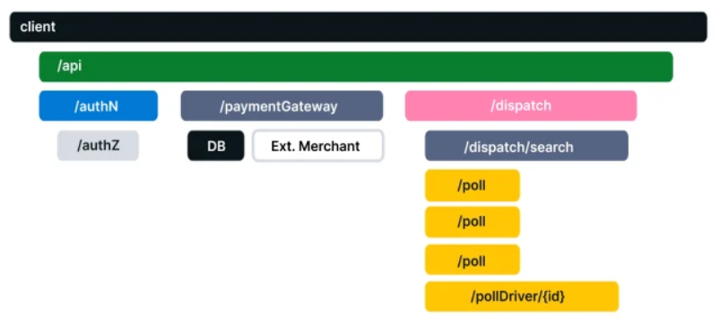

# 【マイクロサービス】可観測性と OpenTelemetry (基本のみ)

OpenTelemetry の以下ドキュメントの内容をまとめた。

- https://opentelemetry.io/docs/concepts/what-is-opentelemetry/
- https://opentelemetry.io/docs/instrumentation/go/getting-started/

## 可観測性のコア概念

OpenTelemetry を知るうえで押さえておくべき概念のためまとめる。

### 可観測性（オブザーバビリティ）

内部の仕組を知らなくてもシステムについて質問（「なぜこれが起こっているのか?」など）できるようにすることで、システムを外部から理解できるようにする（簡単にトラブルシューティングして処理できるようにする）。

### 信頼性と指標

#### テレメトリ

システムから送信された、その動作に関するデータ（Traces、Metrics、Logs）

#### 信頼性

サービスはユーザーが期待していることを実行しているか?」という質問に答える。100%稼働していても、出力が期待通りでなければ「信用できない」となる。

#### メトリクス (指標)

インフラストラクチャまたはアプリケーションに関する一定期間の数値データの集計です。

例：システム エラー率、CPU 使用率、特定のサービスの要求率など

#### SLI (Service Level Indicator)

サービスの動作の測定値を表す。ユーザーの観点からサービスを測定。

SLI の例：Web ページの読み込み速度

#### SLO (Service Level Objective)

組織や他のチームに信頼性を伝達する手段。

1 つ以上の SLI をビジネス価値に関連付けることによって実現される。

### 分散トレース

基本要素

- ログ：サービスまたはその他のコンポーネントによって発行されるタイムスタンプ付きのメッセージ。（ただし Traces とは異なり、それらは必ずしも特定のユーザー要求またはトランザクションに関連付けられているわけではない）

- スパン：作業または操作の単位を表す。リクエストが行う特定の操作を追跡し、その操作が実行されたときに何が起こったのかを把握するためのもの（名前、時間関連のデータ、 構造化されたログ メッセージ、および その他のメタデータ (つまり、属性)が含まれ、追跡する操作に関する情報を提供）ref: [スパン属性](https://opentelemetry.io/docs/concepts/observability-primer/#span-attributes)

分散トレース

- マイクロサービスやサーバーレスアプリケーションなどのマルチサービスアーキテクチャを介して伝播するときに (アプリケーションまたはエンドユーザーによって作成された) リクエストが辿るパスを記録 ＝ 追跡（分散システムにおけるパフォーマンスの問題の原因特定に用いる）

- トレースは、分散システムを通過するときにリクエスト内で何が起こるかを分析することで、分散システムのデバッグと理解を容易にする。また、アプリケーションまたはシステムの状態の可視性が向上し、ローカルでの再現が困難な動作をデバッグできるようになる

- 多くのオブザーバビリティバックエンドは、トレースを以下のようなウォーターフォールダイアグラムとして視覚化する



## OpenTelemetry とは

データを取り込み＆変換し、Observability バックエンド (つまり、オープン ソースまたは商用ベンダー) に送信するための、標準化されたベンダーに依存しない SDK、API、およびツールのセットを提供する。

### 背景

分散されているシステムが拡張されるにつれて、開発者が自分のサービスが他のサービスにどのように依存しているか、または他のサービスにどのように影響しているかを確認することがますます困難になった。（特に速度と精度が重要なデプロイ後または停止中）

システムを監視可能にするには、インストルメント化する必要がある。つまり

- コードは trace、 metrics、 logs を発行する必要がある
- 計測されたデータを Observability バックエンドに送信する必要がある

が、Observability バックエンド は様々あり、Observability バックエンドに送信するデータ（テレメトリ）の形式は標準化されていない ＝ Observability バックエンドの切り替えには、コード再実施や新しい Agent を立てる必要がでてくる（データの移植性がない）。

標準化のためにできた２つの OSS（OpenTracing、OpenCensus）が統合されてできたのが、OpenTelemetry。

## Getting Started (チュートリアル)

チュートリアルを通してみた。コードは以下のままのため部品のみまとめる。

https://opentelemetry.io/docs/instrumentation/go/getting-started/

- スパン
  - これによりスパンが決まる

```go
newCtx, span := otel.Tracer(name).Start(ctx, "<SpanName>")
// :
span.End()
```

Getting Started のコードの App.Run()のループにおける各実行のトレース

```
Run
├── Poll
└── Write
    └── Fibonacci
```

- コンソールエクスポーター
  - テレメトリを OpenTelemetry API からエクスポーターに接続する。
  - エクスポーターは、テレメトリ データをコンソール or リモートシステム or コレクターに送信するためのもの。
  - 後で SDK を構成してテレメトリ データを SDK に送信するときに使用

```go
func newExporter(w io.Writer) (trace.SpanExporter, error) {
	return stdouttrace.New(
		stdouttrace.WithWriter(w),
		// Use human-readable output.
		stdouttrace.WithPrettyPrint(),
		// Do not print timestamps for the demo.
		stdouttrace.WithoutTimestamps(),
	)
}
```

- リソース
  - テレメトリデータがどのサービスからまたはどのサービスインスタンスから来ているかを識別する方法が必要
  - テレメトリを生成するエンティティ = Resource
  - SDK が処理するすべてのテレメトリ データに関連付けたい情報は、以下により返された Resource に追加される。Resource を TracerProvider を登録することで、それがなされる
  - ここで設定した情報が、出力の InstrumentationLibrary になる。

```go
func newResource() *resource.Resource {
	r, _ := resource.Merge(
		resource.Default(),
		resource.NewWithAttributes(
			semconv.SchemaURL,
			semconv.ServiceNameKey.String("fib"),  // どのサービス(自分)からなのかを指定
			semconv.ServiceVersionKey.String("v0.1.0"),
			attribute.String("environment", "demo"),
		),
	)
	return r
}
```

- トレーサープロバイダー
  - トレーサーをトレーサープロバイダーに登録
  - trace.WithBatcher() = データのバッチ処理は良い方法であり、下流のシステムに過負荷をかけないようにするのに役立つ
  - 以下単純な例では、グローバルプロバイダーを使用する方が理にかなっているが、より複雑なコードベースや分散コードベースでは、これらの他の方法で TracerProviders を渡す方が理にかなっている = otel.SetTracerProvider() は グローバルプロバイダー？他にも渡す方法がある。

```go
l := log.New(os.Stdout, "", 0)

// Write telemetry data to a file.
f, err := os.Create("traces.txt")
if err != nil {
    l.Fatal(err)
}
defer f.Close()

exp, err := newExporter(f)
if err != nil {
    l.Fatal(err)
}

tp := trace.NewTracerProvider(
    trace.WithBatcher(exp),  // トレーサー登録
    trace.WithResource(newResource()),
)
defer func() {
    if err := tp.Shutdown(context.Background()); err != nil {
        l.Fatal(err)
    }
}()
otel.SetTracerProvider(tp)
```

- エラー

```go
// func Fibonacci()
if n > 93 {
	return 0, fmt.Errorf("unsupported fibonacci number %d: too large", n)
}
```

```go
// func (a *App) Write
f, err := Fibonacci(n)
if err != nil {
	span.RecordError(err)
	span.SetStatus(codes.Error, err.Error())
}
return f, err
```

### 動作

```sh
$ go run cmd/main.go
What Fibonacci number would you like to know:
11
Fibonacci(11) = 89
```

出力

```json
{
	"Name": "Poll",
	"SpanContext": {
		"TraceID": "7fa9acb4bf524b96c5c7241c96d71cf1",
		"SpanID": "adf6231c571ca0c2",
		"TraceFlags": "01",
		"TraceState": "",
		"Remote": false
	},
	"Parent": {
		"TraceID": "7fa9acb4bf524b96c5c7241c96d71cf1",
		"SpanID": "9b4bc8636e7cfdb7",
		"TraceFlags": "01",
		"TraceState": "",
		"Remote": false
	},
	"SpanKind": 1,
	"StartTime": "0001-01-01T00:00:00Z",
	"EndTime": "0001-01-01T00:00:00Z",
	"Attributes": [
		{
			"Key": "request.n",
			"Value": {
				"Type": "STRING",
				"Value": "11"
			}
		}
	],
	"Events": null,
	"Links": null,
	"Status": {
		"Code": "Unset",
		"Description": ""
	},
	"DroppedAttributes": 0,
	"DroppedEvents": 0,
	"DroppedLinks": 0,
	"ChildSpanCount": 0,
	"Resource": null,
	"InstrumentationLibrary": {
		"Name": "fib",
		"Version": "",
		"SchemaURL": ""
	}
}
{
	"Name": "Fibonacci",
	"SpanContext": {
		"TraceID": "0083174227c68c673cf9c5c98e3d3b54",
		"SpanID": "50df65de267b17c1",
		"TraceFlags": "01",
		"TraceState": "",
		"Remote": false
	},
	"Parent": {
		"TraceID": "0083174227c68c673cf9c5c98e3d3b54",
		"SpanID": "6cb2740b4be9a347",
		"TraceFlags": "01",
		"TraceState": "",
		"Remote": false
	},
	"SpanKind": 1,
	"StartTime": "0001-01-01T00:00:00Z",
	"EndTime": "0001-01-01T00:00:00Z",
	"Attributes": null,
	"Events": null,
	"Links": null,
	"Status": {
		"Code": "Unset",
		"Description": ""
	},
	"DroppedAttributes": 0,
	"DroppedEvents": 0,
	"DroppedLinks": 0,
	"ChildSpanCount": 0,
	"Resource": null,
	"InstrumentationLibrary": {
		"Name": "fib",
		"Version": "",
		"SchemaURL": ""
	}
}
{
	"Name": "Write",
	"SpanContext": {
		"TraceID": "0083174227c68c673cf9c5c98e3d3b54",
		"SpanID": "6cb2740b4be9a347",
		"TraceFlags": "01",
		"TraceState": "",
		"Remote": false
	},
	"Parent": {
		"TraceID": "00000000000000000000000000000000",
		"SpanID": "0000000000000000",
		"TraceFlags": "00",
		"TraceState": "",
		"Remote": false
	},
	"SpanKind": 1,
	"StartTime": "0001-01-01T00:00:00Z",
	"EndTime": "0001-01-01T00:00:00Z",
	"Attributes": null,
	"Events": null,
	"Links": null,
	"Status": {
		"Code": "Unset",
		"Description": ""
	},
	"DroppedAttributes": 0,
	"DroppedEvents": 0,
	"DroppedLinks": 0,
	"ChildSpanCount": 1,
	"Resource": null,
	"InstrumentationLibrary": {
		"Name": "fib",
		"Version": "",
		"SchemaURL": ""
	}
}
{
	"Name": "Run",
	"SpanContext": {
		"TraceID": "7fa9acb4bf524b96c5c7241c96d71cf1",
		"SpanID": "9b4bc8636e7cfdb7",
		"TraceFlags": "01",
		"TraceState": "",
		"Remote": false
	},
	"Parent": {
		"TraceID": "00000000000000000000000000000000",
		"SpanID": "0000000000000000",
		"TraceFlags": "00",
		"TraceState": "",
		"Remote": false
	},
	"SpanKind": 1,
	"StartTime": "0001-01-01T00:00:00Z",
	"EndTime": "0001-01-01T00:00:00Z",
	"Attributes": null,
	"Events": null,
	"Links": null,
	"Status": {
		"Code": "Unset",
		"Description": ""
	},
	"DroppedAttributes": 0,
	"DroppedEvents": 0,
	"DroppedLinks": 0,
	"ChildSpanCount": 1,
	"Resource": null,
	"InstrumentationLibrary": {
		"Name": "fib",
		"Version": "",
		"SchemaURL": ""
	}
}
```
