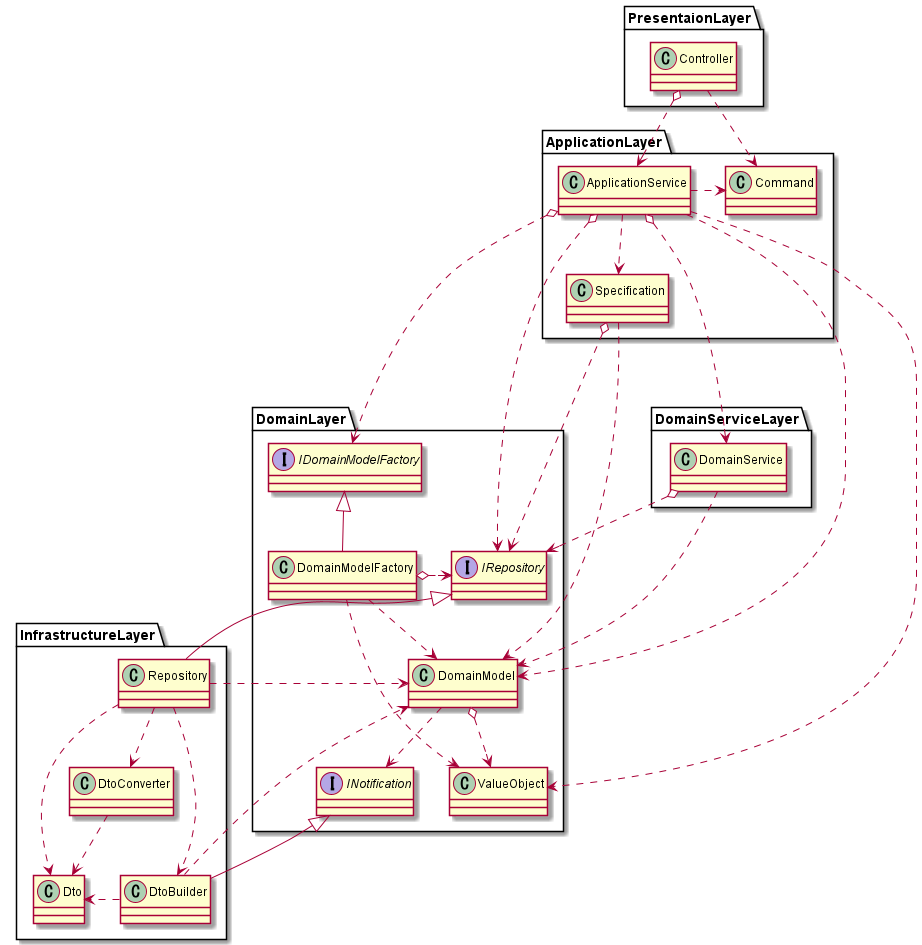

# DDD メモ

随時追記

## DDDのパッケージ構成

以下が参考になる

- [自分が現状気に入っているアプリケーションのパッケージ構成をさらす](https://qiita.com/os1ma/items/286eeec028e30e27587d)

Repositoryのinterfaceはdomain層とQueryServiceのinterfaceはapplication層に置く。それによりrepository層の直依存を切れる。repository→application/domain層への依存を最小化できる。関心の分離の促進

## 集約

※要理解

１トランザクション範囲。ドメイン間はidで結びつけ、巨大オブジェクトとなるのを避ける目的

参考になるかも: [集約の実装について考えてみた](https://zenn.dev/takashi_onawa/articles/4648332c035d97)

## CQRS

- 部分的導入が可能
- QuerySerivceの戻り値がユースケースに依存するものなためUseCase層

以下が参考になる

- [CQRS実践入門 [ドメイン駆動設計]](https://little-hands.hatenablog.com/entry/2019/12/02/cqrs)

- [DDD x CQRS 更新系と参照系で異なるORMを併用して上手くいった話](https://www.slideshare.net/koichiromatsuoka/ddd-x-cqrs-orm)

## ref

- [little hands' lab - ドメイン駆動設計(DDD) 記事一覧](https://little-hands.hatenablog.com/archive/category/%E3%83%89%E3%83%A1%E3%82%A4%E3%83%B3%E9%A7%86%E5%8B%95%E8%A8%AD%E8%A8%88%28DDD%29)

- [ボトムアップドメイン駆動設計 - nrslib](https://nrslib.com/bottomup-ddd/)
    - 具体的サンプルがある

- [indexnext |previous |TERASOLUNA Server Framework for Java (5.x) - ドメイン層の実装](http://terasolunaorg.github.io/guideline/current/ja/ImplementationAtEachLayer/DomainLayer.html#repositoryimpl)

- [ドメイン駆動設計に15年取り組んでわかったこと 「ビジネスルール・値オブジェクト・型」が3つのキーワード](https://logmi.jp/tech/articles/322952)

- [DDD くらいできるようになりたいよねって話](https://style.biglobe.co.jp/entry/2020/01/15/130000)
    - サンプル問題と例有り

- [なぜ自分はDDDを勉強しているのか？](https://zenn.dev/katsukiniwa/articles/a0344d4837ddb8)
    - Aggregate/ドメインモデリングの難しさについて書かれている

- [実践！ Typescript で DDD - マイクロサービス設計のすすめ](https://tech.leverages.jp/entry/2021/08/19/141229)
    - マイクロサービスを考えるなら一読した方が良いかも

- [Domain Driven Design（ドメイン駆動設計） Quickly 日本語版](https://www.infoq.com/jp/minibooks/domain-driven-design-quickly/)

- [最近の海外DDDセミナーを聞いてみたら色々と常識が破壊された](https://qiita.com/dairappa/items/fd136a98cab98c517673)
    - イベントが設計の基本線となりつつあるらしい… pub/subの設計