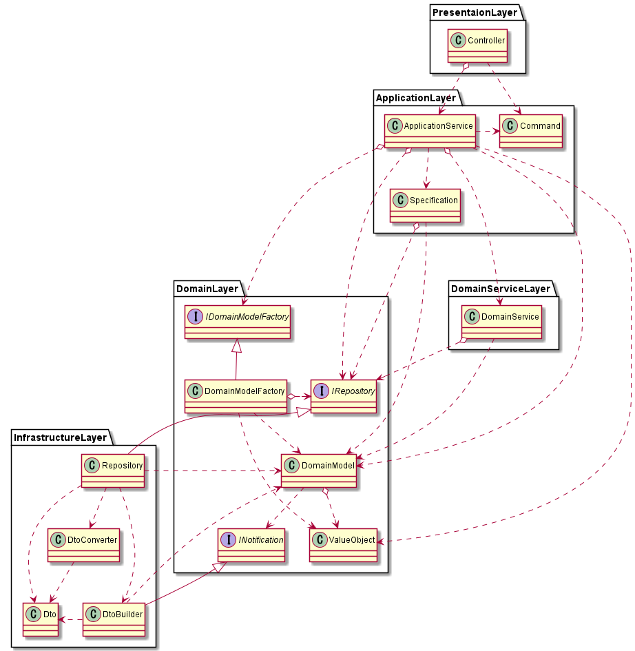

# DDD 実践メモ

随時追記

## DDDのパッケージ構成

以下が参考になる

- [自分が現状気に入っているアプリケーションのパッケージ構成をさらす](https://qiita.com/os1ma/items/286eeec028e30e27587d)

Repositoryのinterfaceはdomain層とQueryServiceのinterfaceはapplication層に置く。それによりrepository層の直依存を切れる。repository→application/domain層への依存を最小化できる。関心の分離



## リポジトリ

- NGパターン
    - 1エンティティに対して複数Repository作る -> データ/ロジックの整合性が取れない
        - 対策：状態更新に関わる振る舞いはEntityやServiceに実装
    - 子テーブルにもRepositoryを作成する -> ビジネス要件のチェックロジックがrepositoryにも持たざるを得なくなったり、チェック処理を迂回して更新ができてしまう
        - 対策：集約を使う
    - 複雑なクエリをRepositoryで発行する -> メンテナンスしづらい、かつ N+1問題にもつながりかねない
        - 対策：CQRS

Repository は集約の単位で作成

ref:

- [やはりお前たちのRepositoryは間違っている](https://qiita.com/mikesorae/items/ff8192fb9cf106262dbf)

## 集約

- 永続化の単位となるクラス群。境界の定義
- １トランザクション範囲。（トランザクション整合性）
- 集約の操作は集約ルートを介してのみ可能
- 集約は小さくし、トランザクションの範囲は最小限にする。->トランザクションの衝突が少なく、スケーラビリティ/性能が良く保てる
- 別の集約ルートはIDのみ保持して参照する->値の同時更新が必要ならEntityを持ち、参照のみで済むならID保持(参照するデータが変わるならID変えるだけで済む)

以下に立ち向かう方法が集約：

- サービスクラスに大量の Repository をインジェクションが必要に…
- オブジェクトの一部だけをロードして、子要素が NULL の状態に…
- データアクセスの設定/記述方法により N + 1 問題発生…

例：

```java
orderRepository.save(order);
order.orderDetails.forEach(orderDetailRepository::save);
```

を、1リポジトリで両方の永続化を行うことで以下となり、コードの複数箇所で Order と OrderDetail 保存する場合にも、１Repository の内部実装にて共通化可能

```java
orderRepository.save(order);
```

ref:

- [「集約」でデータアクセスの 3 つの課題に立ち向かう ~ 大量の Repository・整合性のないオブジェクトのロード・N + 1 問題 ~](https://qiita.com/os1ma/items/28f5d03d3b92e6a1e1d8)
- [集約の実装について考えてみた](https://zenn.dev/takashi_onawa/articles/4648332c035d97)

-

## CQRS

- 部分的導入が可能
- QuerySerivceの戻り値がユースケースに依存するものなためUseCase層

以下が参考になる

- [CQRS実践入門 [ドメイン駆動設計]](https://little-hands.hatenablog.com/entry/2019/12/02/cqrs)

- [DDD x CQRS 更新系と参照系で異なるORMを併用して上手くいった話](https://www.slideshare.net/koichiromatsuoka/ddd-x-cqrs-orm)

## reference indexes

- [little hands' lab - ドメイン駆動設計(DDD) 記事一覧](https://little-hands.hatenablog.com/archive/category/%E3%83%89%E3%83%A1%E3%82%A4%E3%83%B3%E9%A7%86%E5%8B%95%E8%A8%AD%E8%A8%88%28DDD%29)

- [ボトムアップドメイン駆動設計 - nrslib](https://nrslib.com/bottomup-ddd/)
    - 具体的サンプルがある

- [indexnext |previous |TERASOLUNA Server Framework for Java (5.x) - ドメイン層の実装](http://terasolunaorg.github.io/guideline/current/ja/ImplementationAtEachLayer/DomainLayer.html#repositoryimpl)

- [ドメイン駆動設計に15年取り組んでわかったこと 「ビジネスルール・値オブジェクト・型」が3つのキーワード](https://logmi.jp/tech/articles/322952)

- [DDD くらいできるようになりたいよねって話](https://style.biglobe.co.jp/entry/2020/01/15/130000)
    - サンプル問題と例有り

- [なぜ自分はDDDを勉強しているのか？](https://zenn.dev/katsukiniwa/articles/a0344d4837ddb8)
    - Aggregate/ドメインモデリングの難しさについて書かれている

- [実践！ Typescript で DDD - マイクロサービス設計のすすめ](https://tech.leverages.jp/entry/2021/08/19/141229)
    - マイクロサービスを考えるなら一読した方が良いかも

- [Domain Driven Design（ドメイン駆動設計） Quickly 日本語版](https://www.infoq.com/jp/minibooks/domain-driven-design-quickly/)

- [「ビジネスロジック」とは何か、どう実装するのか](https://qiita.com/os1ma/items/25725edfe3c2af93d735)
    - ドメインロジック考える時の参考になりそう

- [最近の海外DDDセミナーを聞いてみたら色々と常識が破壊された](https://qiita.com/dairappa/items/fd136a98cab98c517673)
    - イベントが設計の基本線となりつつあるらしい… pub/subの設計
  
