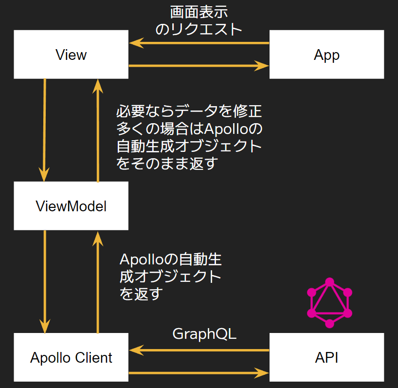

# GraphQL 設計に関する知識メモ 【執筆中】

GraphQL 前提知識色々

- https://graphql.org/learn/
- [GraphQL が解決する問題とその先のユースケース](https://zenn.dev/saboyutaka/articles/07f1351a6b0049)

GraphQL が向いてるケース

- 変化・進化し続けるアプリケーション。複雑性の高いアプリケーション（変化しない/作り切りアプリの場合は REST で十分な可能性）

- フロントエンド視点
  - クライアント/サーバ間での状態同期が必要
    - 特にクライアントからの状態更新(Mutation)が多い
    - 逆にサーバーから一方的にデータが送られる SSR/SSG/Read ヘビーなサイトは REST と SWR で十分な可能性あり
  - モバイルクライアント(低速、劣悪環境)で利用される、複数種類のクライアントがある or る予定がある
  - エンドポイントが多すぎて開発体験が悪い
- サーバーサイド視点
  - クライアントのユースケースによる API 変更が多い
  - Microservices を採用している
  - 大規模なアーキテクチャ変更が必要

GraphQL が向いてない事

- Web API であること、HTTP の制約を受ける
- 巨大なデータ転送
- 非構造型データ、テーブル型のデータを扱う

## 勉強会まとめ：Hatena Engineer Seminar #21 GraphQL 活用編

参加したかった＆楽しみにしていたが、仕事に阻まれとても苦い思いをしたため、後で見てまとめた。

refs:

- https://hatena.connpass.com/event/258042/
- [GraphQL を使い続けて気づいたこと](https://speakerdeck.com/benevolent0505/hatena-engineer-seminar-number-21)
- [マルチテナントで GraphQL を使う際の工夫](https://speakerdeck.com/mizdra/marutitenantote-graphql-woshi-uji-nogong-fu)
- [GraphQL でフロントエンドとバックエンドを分離する](https://speakerdeck.com/magaming/hatena-engineer-seminar-number-21-graphqldehurontoendotobatukuendowofen-li-suru)
- [はてなが作るマンガアプリの GraphQL 導入から活用 ~コミック DAYS から GigaViewer for Apps へ~](https://docs.google.com/presentation/d/12IFQAqs5PxVzKe1Am2woBArFqlkXEv0Os5LJ-KwNUqU/edit#slide=id.gc6f889893_0_0)

### GraphQL を使い続けて気づいたこと

- GraphQL のスキーマ設計によって、フロントエンド/バックエンド共に無理のない実装が可能
  - フロントエンド/バックエンドの実装上の都合を一方に押し付け合わずに済む

フロントエンドの都合

- 画面に表示するデータのみが欲しい
- 1API から様々なデータが欲しい
- 上記はバックエンドに不都合
  - 1API の処理で様々なデータ集める/返す。そのために多くのパラメータを考慮する
  - ＝ バックエンドの実装複雑化

バックエンドの都合

- REST API のように作りたい (リソースや操作に対してエンドポイントを作成するため秩序立った API にできる)
- 上記はフロントエンドには不都合
  - 表示するために必要なデータを取得するために何度も API リクエストを行う必要が生じる
  - 表示に必要ない余分なデータまでも一緒に取得してしまう
  - ＝ フロントエンドの実装複雑化、パフォーマンス劣化

GraphQL はこれ（実装上の都合）を解消する

- フロントエンドの都合を満たし、バックエンドに不都合な実装をさせずに済む

#### タグ機能の実現

都合

- フロント：ユーザが元々入力したものを表示したい
- バック：英大文字/小文字を同じタグと識別したい -> テキストを正規化して保持

機能要件

- (英大文字/小文字を同じタグと識別した上で)
  - 作品に紐づけられたタグを一覧表示可能
  - タグが付いた作品を一覧表示可能

スキーマやクエリは

```gql
type Tag {
  title: String!    // ★
  works: [Work!]!
}
type Work {
  tags: [Tag!]!
}
```

```
query {
    work($id: ID!) {
        tags {
            title   // ★
        }
    }
}
```

上記だと、「英大文字/小文字を同じタグと識別」できない

- フロントエンドは返ってきたデータを表示するだけ
- バックエンドは、返すデータを作品によって出しわける必要が生じるため、煩雑に（仕様の都合を背負う）

これを解決するためにスキーマを改善

- DB の中間テーブルのような Type を追加

```
type Tag {
  title: String!    // 正規化して保持しているタイトル
}
type WorkTag {
    title: String!  // ユーザが元々入力したタイトル = 表示するタイトル
    tag: Tag!
}
type Work {
  workTags: [WorkTag!]!
}
```

```
query {
    work($id: ID!) {
        workTags {
            title
        }
    }
}
```

#### まとめ（ポイント）：

- GraphQL のスキーマ設計にて、フロントエンドが欲しいデータ/バックエンド実装上の都合も考慮することで、
  フロントエンド/バックエンド両者で無理のない実装が可能になる
- フロントエンド/バックエンド両者の実装の詳細から一歩引いた立場で設計すること（詳細をそのままスキーマにしない）

スキーマ設計をうまく回すための Tips：

- フロントエンド/バックエンド両者に理解があり（画面で欲しいリソースを理解し、バックエンドの実装/都合に通じている）スキーマ設計時に自然と両者の都合を考慮できている
- ワイヤーフレーム => リソース検討 => スキーマ設計 の流れで行うのが良い（かもしれない）
  - (GraphQL に限った話でなく)ユーザが見る物から検討を始める

## マルチテナントで GraphQL を使う際の工夫

マルチテナントとは、同一のシステムやサービスを、無関係な複数のユーザー（企業や個人）で共有するモデル

ref: [マルチテナントとは　～シングルテナントとの違いからメリットまで徹底解説～](https://www.intra-mart.jp/im-press/useful/a65)

利用ユーザ（複数サイト）によって、使用できる機能や表示する物を切り替える（ON/OFF）

→ Feature Toggle を使う

Feature Toggle とは、コードを変更することなくシステムの振る舞いを変えることができる

refs:

- [Feature Toggles (aka Feature Flags)](https://martinfowler.com/articles/feature-toggles.html)
- [Feature Toggle について整理してみました](https://cabi99.hatenablog.com/entry/2019/10/21/144441)

クライアント側

- 狙ったものだけを出し分ける

```typescript
function UserInfoPage() {
  const { user, error } = useUserQuery(query);
  if (error) throw error;
  return (
    <div>
      <div>User: {user?.name}</div>
      {user?.point ?? <div>Point: {user?.point}</div>}
    </div>
  );
}
```

サーバ側

- エラーは返さず NULL を返す

### はてなが作るマンガアプリの GraphQL 導入から活用 ~コミック DAYS から GigaViewer for Apps へ~

GraphQL 導入後は、フロントエンドは、以下のようなアーキテクチャが可能



ref: [はてなが作るマンガアプリの GraphQL 導入から活用 ~コミック DAYS から GigaViewer for Apps へ~](https://docs.google.com/presentation/d/12IFQAqs5PxVzKe1Am2woBArFqlkXEv0Os5LJ-KwNUqU/edit#slide=id.g14b6ae56976_0_51)

※ 補足

- GraphQL 導入でそれまでのレイヤー構造を捨てた（Apollo の自動生成オブジェクトをそのまま利用する形態に）
- GraphQL では Repository 層は大体アンチパターン

ref: https://twitter.com/adwd118/status/1569675348232773632

## その他

- !uery は Usecase
- Schemas/Types は Resource

### GraphQL を利用したアーキテクチャの勘所

ref: [GraphQL を利用したアーキテクチャの勘所 / Architecture practices with GraphQL](https://speakerdeck.com/qsona/architecture-practices-with-graphql)

GraphQL の特徴

- Web API として提供する Schema と 欲しいデータを取得する Query。これらが分離されている
- 概念の対応
  - Query <=> Usecase
  - Schemas, Types <=> Resource

イメージ：

| GraphQL Query         | GraphQL Schemas and Types |
| --------------------- | ------------------------- |
| Usecase               | Resource                  |
| Presetation           | Domain                    |
| System of Engagement  | System of Resource        |
| Frontend (が欲する物) | Backend (が提供するもの)  |

Resource ベースの API と Usecase ベースの API の良いところを両立できる

GraphQL Web API 設計の勘所

- 基本的に Resources-based API として作る（GraphQL の良さを活かすため）
- [Schemas and Types](https://graphql.org/learn/schema/) を Resource、 query を Usecase で表す
- 注意深い Resource (≒ Schemas/Types) 設計を行う
  - Usecase をきちんと理解した上で、同時にデータ設計をイメージする
  - 以下を満たすスキーマを考える
    - ユースケースを自然に満たせる（複雑な query や client 実装にはならない）
    - データ設計から自然に resolvers の実装ができる
    - ビジネス的な共通理解や共通言語を正しく反映している

注意点：

- N+1 問題
  - クエリの自由度が高すぎるが故、パフォーマンス低下を引き起こす可能性あり
    - 配列でも中身の詳細まで取得するクエリも書けてしまう（サーバ側で適切に対処しない場合、N+1 問題が起きる可能性あり）
  - 対処法
    - Dataloader Pattern
      - 典型的にはこちらで対応
      - resolver を遅延評価し、バッチで実行する仕組み
    - ユースケース管理と妥協
      - Dataloader が適用できないようなケースはこちらで対応
      - 実際に投げられることのないクエリは対処不要に倒せる
      - Presistend Queries：クライアントが投げうるクエリを事前に GraphQL サーバに登録する手法、登録されていないものは弾く

### Hasura

- 初期は Hasura の API をそのまま使うことで、実装コストを下げられる。
- 実装が複雑化してきたら、Remote Schema を活用し、ロジックをバックエンドに寄せる。

ref: [GraphQL を利用したアーキテクチャの勘所 / Architecture practices with GraphQL](https://speakerdeck.com/qsona/architecture-practices-with-graphql)

Hasura が提供するスキーマは、GraphQL の仕様に沿わず、DB(というより SQL)に寄せているものもある

https://hasura.io/docs/latest/queries/postgres/pagination/

その他：

- [多機能な GraphQL サーバー: Hasura GraphQL Engine を知っておきたい人が読む記事](https://qiita.com/sho-hata/items/2dbd41be42662007071e)
- [もう API を自分で開発するのは古い？Hasura の強烈な有効性について紹介する](https://qiita.com/yuno_miyako/items/4a4f68a473231f8c07cd)
- [Building a GraphQL API with Golang, Postgres, and Hasura](https://hasura.io/blog/building-a-graphql-api-with-golang-postgres-and-hasura/)

## Stock

- [【iCARE Dev Meetup #35】Web フロントエンドから見た GraphQL の世界](https://www.youtube.com/watch?v=9NzFH1ObO_M)
- [フロントエンドのパラダイムを参考にバックエンド開発を再考する / TypeScript による GraphQL バックエンド開発](https://speakerdeck.com/naoya/typescript-niyoru-graphql-batukuendokai-fa)
- [TypeScript による GraphQL バックエンド開発 ─ TypeScript の型システムとデータフローに着目した宣言的プログラミング](https://speakerdeck.com/naoya/typescript-niyoru-graphql-batukuendokai-fa-75b3dab7-90a8-4169-a4dc-d1e7410b9dbd)
- [Shopify に学ぶ！GraphQL API 設計 5 つのポイント](https://ichyaku.com/graphql-api-design/)
- [チュートリアル: GraphQL API の設計](https://github.com/Shopify/graphql-design-tutorial/blob/master/lang/TUTORIAL_JAPANESE.md)
- [GraphQL API 設計で気をつけること](https://wawoon.dev/posts/tips-of-graphql-schema-design)
- [Relay に学ぶ GraphQL のスキーマ設計](https://cockscomb.hatenablog.com/entry/designing-graphql-schema-learned-from-relay)
- [Relay - GraphQL Server Specification](https://relay.dev/docs/guides/graphql-server-specification/)
- [CQRS の観点から考える GraphQL のスキーマ設計](https://zenn.dev/tak_iwamoto/articles/88e413a895e9cf)
