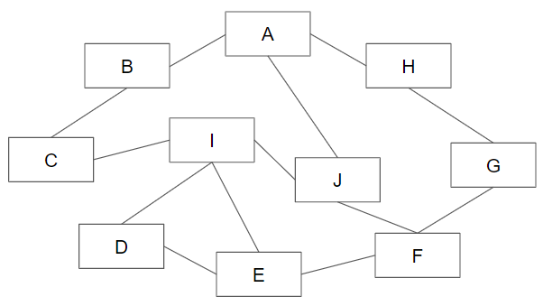

# GraphQLについてまとめる

## 概要

目的を一言で表現するならば

- １つのエンドポイントでシステムが管理するリソースから欲しい情報のみを柔軟かつ正確に取得できるようにする

特徴

- サーバから必要なデータを必要な分だけ、過不足なく（指定した物だけを）取得する
- 1度のリクエストで（関連のある）複数リソースのデータを取得可能
- 1 EndPoint。Queryで指定

以下、REST API の課題を解消する狙い

- 過剰なデータ取得（使わない属性も取得する）
- 過少なデータ取得（ネストした情報を取るには複数エンドポイントから取得要）
- (拡張時に) End point の追加が必要になる

> （GraphQLドキュメントより翻訳）
>
> GraphQLはRESTに代わる、より効率的で強力かつ柔軟な代替手段を提供する新しいAPI標準です。GraphQLは、そのコアで、クライアントがAPIから必要なデータを正確に指定できる宣言型データフェッチを可能にします。固定データ構造を返す複数のエンドポイントの代わりに、GraphQLサーバーは単一のエンドポイントのみを公開し、クライアントが要求したデータで正確に応答します。

## REST API vs GraphQL

REST API：リソースベース

- メリット
    - リソースが容易に分かる
    - シンプルで一貫性のある設計 (URIと情報の操作が対応する)
- デメリット
    - リソース毎にエンドポイントを提供、固定データ構造を返却
        - クライアントが必要としていないデータも返却
        - 必要なデータを揃えるために複数エンドポイントの結果を組み合わせが必要なケース発生
        - 必要な関連データも一括で返すようにするとレスポンス肥大化
    - 融通が利かないため柔軟に要求に対応不可
        - 無理に対応すれば上記に繋がり、余分にリソースを消費、レスポンス遅延等に繋がりかねない

GraphQL：ユースケースベース(でqueryを定義するのが良いとされている)

- メリット
    - 少ないリクエストで複数のリソースにアクセス可能
    - 最小限のデータのみを取得
    - 既存のクエリを破壊せずAPIの更新が可能 (要求に柔軟に対応可能)
- デメリット
    - キャッシュが複雑になる
    - クエリーの自由度の高さ故に負荷予測や対策がし辛い
    - クエリのパース処理の実装コスト＆難易度は高いためライブラリ依存になる
    - 画像や動画などの大容量バイナリの扱いが難しい

### GraphQLが真価を発揮するケース

間違いなく言えるのは、管理しているデータが網目状に関連を持ち、(ユースケース的に)色々なルートでその関連を辿る必要がある場合

分かりやすい例：

これをREST APIで対応しようとすると

- 各APIでまとめて関連データも返そうとするとレスポンス肥大化
- 各APIで対象リソースの関連データについてはIDのみ返すようにしても1ユースケースを満たすために複数API実行

となり、RESTの悪い点を踏む

### RESTを使った方が良い時（個人の所感）

「GraphQLの方が色んな面で優れているため、RESTよりGraphQLを使った方が良い」とはならないケースはあるはず。

REST APIの優位性は、シンプルさと統一性（HTTPメソッドとリソースに対応するURI）。

GraphQLサーバ と REST API サーバ の利用者目線（利用者≠フロントエンド。単純にAPIを打つ人という位置づけ）で考えた時に、

GraphQL は、必ずクエリを指定し、対象のリソースや欲しい情報を指定しなければならない。つまり、利用者にその負担を強いる（REST API
も更新系は概ねリクエストボディで情報を送る必要があるため手間はそこまで変わらないかもしれないが、参照系はそうでもない）。

複数のサービスから、１リソースの情報を取得しようとした時にどちらが扱いやすいかを考えるとREST API
に軍配が上がるだろう（GraphQLだと、複数サービスで同じユースケース（とあるリソース情報を取得する）があれば、複数サービスで同じクエリを持つことになる）。

ただ、RESTでは要求に柔軟に対応することも、リソース間の関連が多いようなデータを扱うのは不得意なため

- リソース間の関連がさほど多くなく
- あまり変更が入らないようなデータ

は、REST API の方が良いのではないか。DBで管理するマスターデータ、トランザクションデータのうちの、マスターデータにあたるような物は、データ構造次第ではREST APIの方が扱いやすい可能性があると思われる。

## Relay Server Specification

GraphQL拡張仕様

- Relay Node (Globally unique ID)
- Relay Connection (Edge, Node, cursor based pagination)
- Relay Mutation

https://relay.dev/docs/guides/graphql-server-specification/

## GraphQLが果たす役割

Todo

## GraphQL Client & Server

Client

- サーバへのクエリの実行とレスポンスの確認 Server
- クエリに基づいてデータを返す
    - イメージ的には、DBからデータを取得する際には SELECT はせず、アプリケーション側でSELECTすることで指定されたものだけを返すイメージ

Client と Server どちらも用意できるのが [Apollo](https://www.apollographql.com/)

Apollo Server は、REST APIをデータソースとすることもできるため、Apollo Serverをプロキシとし、GraphQLのインターフェースを提供することができる。つまり、段階的移行が可能である。

[Apollo ServerとPrismaではじめるGraphQL API開発入門](https://zenn.dev/eringiv3/books/a85174531fd56a)

[Apollo なら爆速で GraphQL サーバーと GraphQL クライアントアプリが作れる](https://qiita.com/jintz/items/4ddc6bf4f95238eff5e9)

## N+1問題への対応

[GraphQL で N+1 問題を解決する 4 つのアプローチ](https://zenn.dev/alea12/articles/15d73282c3aacc)

## link stack

- doc
    - https://graphql.org/

- important
    - [GraphQLが解決する問題とその先のユースケース](https://zenn.dev/saboyutaka/articles/07f1351a6b0049)

- 概要/特徴
    - [「GraphQL」徹底入門 ─ RESTとの比較、API・フロント双方の実装から学ぶ](https://eh-career.com/engineerhub/entry/2018/12/26/103000)
    - [【書評】「初めてのGraphQL」を読んで、サーバーレスアプリケーションのための新しい武器を手に入れるのだ](https://dev.classmethod.jp/articles/learning-graphql/)
    - [GraphQL入門](https://zenn.dev/yoshii0110/articles/2233e32d276551)
    - [これを読めばGraphQL全体がわかる。GraphQLサーバからDB、フロントエンド構築](https://reffect.co.jp/html/graphql)
    - [GraphQLとは？RESTとの違いや導入事例を紹介](https://udemy.benesse.co.jp/development/system/graphql.html)
    - [GraphQLの要点が分かる！メリットとデメリット](https://mizumotok.hatenablog.jp/entry/2021/07/18/211339)
    - [「GraphQLは何に向いているか」に対してのちょっとした反論](https://yamitzky.hatenablog.com/entry/graphql)
    - [Securing Your GraphQL API from Malicious Queries](https://www.apollographql.com/blog/graphql/security/securing-your-graphql-api-from-malicious-queries/)

- 設計
    - [CQRSの観点から考えるGraphQLのスキーマ設計](https://zenn.dev/tak_iwamoto/articles/88e413a895e9cf)
    - [TypeScript * GraphQLのバックエンド設計プラクティス](https://zenn.dev/tatta/books/5096cb23126e64)
    - [GraphQLはサーバーサイド実装のベストプラクティスとなるか](https://qiita.com/saboyutaka/items/8a75602a3a7b52af1a69)
    - [GraphQLの全体像とWebApp開発のこれから](https://qiita.com/saboyutaka/items/171f7382cdf75b67d076)

- 実装
    - [NestJSでMySQLを利用したGraphQLなAPIを構築してみる](https://zenn.dev/himorishige/articles/04ad0aeb5cc065)
    - [ぼくのかんがえたさいきょうの個人開発あーきてくちゃ](https://zenn.dev/eringiv3/articles/c44d5400e5603e)
    - [Apollo なら爆速で GraphQL サーバーと GraphQL クライアントアプリが作れる](https://qiita.com/jintz/items/4ddc6bf4f95238eff5e9)

- その他
    - [GraphQL クライアントの比較](https://zenn.dev/seya/scraps/9d64f2e9cae500)
    - [REST APIって何？REST APIを理解しよう](https://hinoapp.com/rest_api_how_to/)

- 対応言語
    - [Code using GraphQL](https://graphql.org/code/)