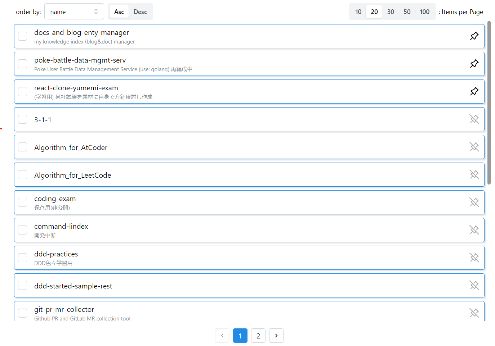
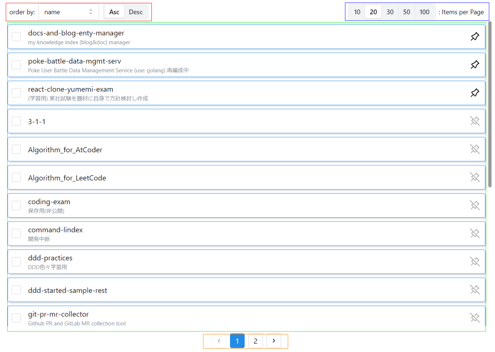

# React + GraphQL + Pagination 実装 ＆ コンポーネント分割

## 作成物と本記事で触れること概要

以下を使って

- React
- [Mantine](https://mantine.dev/)
- [urql](https://github.com/urql-graphql/urql)
- [Github GraphQL API](https://docs.github.com/ja/graphql)

（開発中のフロントエンドアプリ(と言うよりはツールレベル)のほんの１部品でしかないが）
Github の Repository 一覧表示＆Pagination ができるコンポーネントを作っている



(他にももう少し機能追加したり装飾を良くする予定だが) 現時点では、pagination 以外にも

- 1 ページ辺りの表示件数変更 (右上の items per page)
- ピン留め（右端のピンを ON にすると１ページ目の先頭に固定）
- ソート（左上の order by）

をできるようにしている。これを実装するにあたって悩んだこと 以下２つに触れる

- Github GrapQL API 利用での pagination 実装
- pagination + α 実装コンポーネントの分割

## Github GrapQL API 利用での pagination 実装

今回訳あって、自前で pagination の仕組みを実装した。

Github GrapQL API さんは、そもそも pagination の仕組みをサポートしているため、以下のような指定でき、やろうと思えば簡単に実現できると言えばできる。

- 何件取得するか
- ソート
- どこから取得するか (cursor 指定)

ただし、「2 ページ先、3 ページ先、... のデータ取得」ができない（１ページ前後のデータ取得はできる）

ユーザビリティの観点から、これがアプリでできないことを許容しきれず、実現方法を考えた結果が以下３つ。

- 最初に全件取得して保持する
  - デメリット：
    - データ多量の場合、パフォーマンス劣化に繋がる恐れがある
    - API を複数回実行する必要があるため、コンポーネントの読込中かの状態を自前で管理する必要がある（実装コスト増）
- 最初に全件取得して各ページの先頭の cursor を保持する（ページ遷移時は、そのページの先頭の cursor を指定して GraphQL API を実行しデータを取得する）
  - デメリット：
    - ソートや１ページ辺りの表示件数が変更された際に全件再取得が必要（キャッシュがあるので最初の１回のみ）
      - 初めてその操作を行われた時に取得とすると、途中で Repository が作られた場合に、条件次第で表示されたりされなかったりする Repository ができてしまう (データ不整合)
      - それを回避しようとキャッシュの有効期限を短くしてしまうと、操作する毎に頻繁に読込中になり、ユーザビリティが落ちる
- そもそも GraphQL API 使うのを諦めて REST API を使う
  - デメリット：
    - 要らないフィールドも一緒に沢山取れてしまう（パフォーマンス劣化）
    - 実現したいことにより１度に複数の API を使用する必要が出た際に面倒になる（実装コストが上がる）
    - ページ遷移のために都度 API 実行のため読込中になる（ユーザビリティは 1 点目より劣る）

この中から今回は、ユーザビリティ優先で、1 点目の「最初に全件取得して保持する」とした。

デメリットの「データ多量の場合、パフォーマンス劣化に繋がる恐れがある」に関して、特に初期描画の場合、全データ取得してから読込中解除 → 操作可能としたのでは、データ多量の場合に操作可能になるまでに時間を要することが考えられる。それを回避するために以下の工夫した。

- 初回描画時、1 ページ目に表示する内容のみを取得し完了すれば読込中解除して一覧を表示。
- 全件データ取得は別途実行し、取得完了しても一覧の表示を更新しないよう `useRef` を使用して保持（`useRef` を使用すれば更新しても再レンダリングは発生しない）
- 全件データ取得が終わるまでは、（1 ページ目に表示する内容のみ取得が済めば一覧表示されるが）pagination の機能は無効化

```tsx
export const CheckableLineBoxesPagination = ({
  selectedItems,
  setSelectedItems,
  fetchFirstPageData,
  fetchAllPageData,
  currentViewItems, // 現在のページに表示するデータのみ持つstate
  initCurrentViewItems,
  updateCurrentViewItems,
  children,
}: CheckableLineBoxesPaginationProps) => {
  const [activePage, setActivePage] = useState(1); // 現在のページ
  const [totalPages, updateTotalPages] = useTotalPages(); // ページ数合計
  const [itemsPerPage, setItemsPerPage] = useItemsPerPage(20); // 1ページ辺りの表示件数
  const [isLoading, setIsLoading] = useState(true);
  const [enabledPagination, setEnabledPagination] = useState(false);
  const allItems = useRef<CheckableLineData[]>([]);

  useEffect(() => {
    // １ページ目のデータのみ取得するための処理
    const initialize = async () => {
      const data = await fetchFirstPageData(itemsPerPage);
      if (data) {
        initCurrentViewItems(data.items);
        updateTotalPages(data.totalCount, itemsPerPage);
      }
      setIsLoading(false);
    };
    // 全件データ取得するための処理
    const fetchAllData = async () => {
      const repos = await fetchAllPageData();
      allItems.current = repos;
      setEnabledPagination(true);
    };
    initialize();
    fetchAllData();
  }, []);

  // 省略 全体は次節参照
};
```

## pagination + α 実装コンポーネントの分割

### Before

リポジトリ一覧表示（pagination 付）の当初ソース

- 一覧表示は、PR 一覧などへ再利用したいため、汎用化。
  - 具体：repository-list コンポーネント
  - 抽象（汎用化）：checkable-line-boxes-pagination コンポーネント

※この時点は、ソート機能未実装で、リポジトリ名昇順固定

- repository-list コンポーネント

```tsx
type Props = {
  selectedRepositories: string[];
  setSelectedRepositories: (items: string[]) => void;
  fetchFirstPageRepositories: (
    itemPerPage: number
  ) => Promise<{ items: CheckableLineData[]; totalCount: number } | undefined>;
  fetchAllRepositories: () => Promise<CheckableLineData[]>;
};

export const RepositoryList = ({
  selectedRepositories,
  setSelectedRepositories,
  fetchFirstPageRepositories,
  fetchAllRepositories
}: Props) => {
  const [pinnedRepoNames, getPinState, togglePin] = usePinnedRepos();

  const sortPinnedReposToTop = (repos: CheckableLineData[]): CheckableLineData[] => {
    const pinnedRepos = repos.filter((repo) => pinnedRepoNames.includes(repo.value)).sort(sortLogic);
    const nonPinnedRepos = repos.filter((repo) => !pinnedRepoNames.includes(repo.value)).sort(sortLogic);
    return [...pinnedRepos, ...nonPinnedRepos];
  };
  const [currentViewItems, initCurrentViewItems, updateCurrentViewItems] = useCurrentViewItems(sortPinnedReposToTop);

  return (
    <CheckableLineBoxesPagination
      selectedItems={selectedRepositories}
      setSelectedItems={setSelectedRepositories}
      fetchFirstPageData={fetchFirstPageRepositories}
      fetchAllPageData={fetchAllRepositories}
      currentViewItems={currentViewItems}
      initCurrentViewItems={initCurrentViewItems}
      updateCurrentViewItems={updateCurrentViewItems}
    >
      {currentViewItems.map((item, index) => {
        let marginStyle = { margin: '0.5rem' };
        if (index === 0) {
          marginStyle = { margin: '0.1rem 0.5rem 0.5rem 0.5rem' };
        } else if (index === currentViewItems.length - 1) {
          marginStyle = { margin: '0.5rem 0.5rem 0.1rem 0.5rem' };
        }
        return (
          <CheckableLineBox
            key={item.key}
            value={item.value}
            title={item.title}
            subText={item.subtext}
            style={marginStyle}
            suffixNode={<TogglePin pinned={getPinState(item.value)} togglePin={() => togglePin(item.value)} />}
          />
        );
      }
    </CheckableLineBoxesPagination>
  );
};
```

- checkable-line-boxes-pagination コンポーネント

```tsx
type CheckableLineBoxesPaginationProps = {
  selectedItems: string[];
  setSelectedItems: (items: string[]) => void;
  fetchFirstPageData: (
    itemPerPage: number
  ) => Promise<{ items: CheckableLineData[]; totalCount: number } | undefined>;
  fetchAllPageData: () => Promise<CheckableLineData[]>;
  currentViewItems: ReturnType<typeof useCurrentViewItems>[0];
  initCurrentViewItems: ReturnType<typeof useCurrentViewItems>[1];
  updateCurrentViewItems: ReturnType<typeof useCurrentViewItems>[2];
  children: ReactNode;
};

export const CheckableLineBoxesPagination = ({
  selectedItems,
  setSelectedItems,
  fetchFirstPageData,
  fetchAllPageData,
  currentViewItems,
  initCurrentViewItems,
  updateCurrentViewItems,
  children,
}: CheckableLineBoxesPaginationProps) => {
  const [activePage, setActivePage] = useState(1);
  const [totalPages, updateTotalPages] = useTotalPages();
  const [itemsPerPage, setItemsPerPage] = useItemsPerPage(20);
  const [isLoading, setIsLoading] = useState(true);
  const [enabledPagination, setEnabledPagination] = useState(false);
  const allItems = useRef<CheckableLineData[]>([]);

  useEffect(() => {
    const initialize = async () => {
      const data = await fetchFirstPageData(itemsPerPage);
      if (data) {
        initCurrentViewItems(data.items);
        updateTotalPages(data.totalCount, itemsPerPage);
      }
      setIsLoading(false);
    };
    const fetchAllData = async () => {
      const repos = await fetchAllPageData();
      allItems.current = repos;
      setEnabledPagination(true);
    };
    initialize();
    fetchAllData();
  }, []);

  useEffect(() => {
    updateCurrentViewItems(allItems.current, itemsPerPage, activePage);
  }, [activePage]);
  useEffect(() => {
    updateTotalPages(allItems.current.length, itemsPerPage);
    updateCurrentViewItems(allItems.current, itemsPerPage, activePage);
    setActivePage(1);
  }, [itemsPerPage]);

  if (isLoading) {
    // Todo
    return <div>Loading...</div>;
  }

  if (currentViewItems == null || currentViewItems.length == 0) {
    // Todo
    return <div>Empty</div>;
  }

  return (
    <>
      <Flex justify="flex-end" align="center" direction="row">
        <SegmentedControl
          value={itemsPerPage.toString()}
          onChange={setItemsPerPage}
          data={itemsPerPageList}
          disabled={!enabledPagination}
        />
        <Text fz="sm" sx={{ marginRight: "1rem" }}>
          : Items per Page
        </Text>
      </Flex>
      <ScrollAreaWapper>
        <Checkbox.Group value={selectedItems} onChange={setSelectedItems}>
          {children}
        </Checkbox.Group>
      </ScrollAreaWapper>
      <Pagination
        sx={{
          padding: "0.5rem 0.25rem",
        }}
        total={totalPages}
        position="center"
        value={activePage}
        onChange={setActivePage}
        disabled={!enabledPagination}
      />
    </>
  );
};
```

1 コンポーネントに useEffect が 3 つ…

責任分担できてなくて、ひとまとめになっている感じなので、分割

### After 1

以下のイメージで部品ごとに分割を試みる



- repository-list コンポーネント

```tsx
export const RepositoryList = ({
  selectedRepositories,
  setSelectedRepositories,
  fetchFirstPageRepositories,
  fetchAllRepositories,
}: Props) => {
  const [currentViewItems, initCurrentViewItems, updateCurrentViewItems] =
    useCurrentViewItems();
  const [getAllItems, setAllItems] = useAllItemsAccessor();
  const [sorter, dispatch] = useSorterReducer();
  const [pinnedItemNames, getPinState, togglePin] = usePinnedItems();

  const pinnedItemsToTopSorter = (
    items: CheckableLineData[]
  ): CheckableLineData[] => {
    const sortedPinnedItems = sorter(
      items.filter((item) => pinnedItemNames.includes(item.value))
    );
    const sortedNonPinnedItems = sorter(
      items.filter((item) => !pinnedItemNames.includes(item.value))
    );
    return [...sortedPinnedItems, ...sortedNonPinnedItems];
  };

  const handleClickPin = () => {
    setAllItems(pinnedItemsToTopSorter(getAllItems()));
  };

  return (
    <CheckableLineBoxPagination
      allItemsAccessor={[getAllItems, setAllItems]}
      selectedItems={selectedRepositories}
      setSelectedItems={setSelectedRepositories}
      fetchFirstPageData={fetchFirstPageRepositories}
      fetchAllPageData={fetchAllRepositories}
      currentViewItemsStateSet={[
        currentViewItems,
        initCurrentViewItems,
        updateCurrentViewItems,
      ]}
      sorterReducerSet={[pinnedItemsToTopSorter, dispatch]}
    >
      <CheckableLineBoxListWithPin
        currentViewItems={currentViewItems}
        handleClickPin={handleClickPin}
        pinnedItemsStateSet={[pinnedItemNames, getPinState, togglePin]}
      />
    </CheckableLineBoxPagination>
  );
};
```

- checkable-line-boxes-pagination コンポーネント

```tsx
type CheckableLineBoxesPaginationProps = {
  allItemsAccessor?: ReturnType<typeof useAllItemsAccessor>;
  selectedItems: string[];
  setSelectedItems: (items: string[]) => void;
  fetchFirstPageData: (
    itemPerPage: number
  ) => Promise<{ items: CheckableLineData[]; totalCount: number } | undefined>;
  fetchAllPageData: () => Promise<CheckableLineData[]>;
  currentViewItemsStateSet?: ReturnType<typeof useCurrentViewItems>;
  sorterReducerSet?: ReturnType<typeof useSorterReducer>;
  children: ReactNode;
};

export const CheckableLineBoxesPagination = ({
  allItemsAccessor: [getAllItems, setAllItems] = useAllItemsAccessor(),
  selectedItems,
  setSelectedItems,
  fetchFirstPageData,
  fetchAllPageData,
  currentViewItemsStateSet: [
    currentViewItems,
    initCurrentViewItems,
    updateCurrentViewItems,
  ] = useCurrentViewItems(),
  sorterReducerSet: [sorter, dispatch] = useSorterReducer(),
  children,
}: CheckableLineBoxesPaginationProps) => {
  const [activePage, setActivePage] = useState(1);
  const [totalPages, updateTotalPages] = useTotalPages();
  const [itemsPerPage, setItemsPerPage] = useItemsPerPage(20);
  const [isLoading, setIsLoading] = useState(true);
  const [enabledPagination, setEnabledPagination] = useState(false);

  useEffect(() => {
    const initialize = async () => {
      const data = await fetchFirstPageData(itemsPerPage);
      if (data) {
        initCurrentViewItems(data.items);
        updateTotalPages(data.totalCount, itemsPerPage);
      }
      setIsLoading(false);
    };
    const fetchAllData = async () => {
      const items = await fetchAllPageData();
      setAllItems(sorter(items));
      setEnabledPagination(true);
    };
    initialize();
    fetchAllData();
  }, []);

  const handleSelectOrderBy = () => {
    if (!enabledPagination) {
      // 初回描画時に 全データ取得が終わっていない状態でこの関数が呼ばれ、空になるため終わるまでは何もしない
      return;
    }
    setAllItems(sorter(getAllItems()));
    updateCurrentViewItems(getAllItems(), itemsPerPage, activePage);
  };

  const handleSelectActivePage = () => {
    if (!enabledPagination) {
      // 初回描画時に 全データ取得が終わっていない状態でこの関数が呼ばれ、空になるため終わるまでは何もしない
      return;
    }
    updateCurrentViewItems(getAllItems(), itemsPerPage, activePage);
  };

  const handleSelectItemsPerPage = () => {
    if (!enabledPagination) {
      // 初回描画時に 全データ取得が終わっていない状態でこの関数が呼ばれ、空になるため終わるまでは何もしない
      return;
    }
    const firstPage = 1;
    updateTotalPages(getAllItems().length, itemsPerPage);
    setActivePage(firstPage);
    updateCurrentViewItems(getAllItems(), itemsPerPage, firstPage);
  };

  if (isLoading) {
    // Todo
    return <div>Loading...</div>;
  }

  if (currentViewItems == null || currentViewItems.length === 0) {
    // Todo
    return <div>Empty</div>;
  }

  return (
    <>
      <Group position="apart" sx={{ margin: "0 1rem" }}>
        <OrderSelectBox
          handleSelectOrder={handleSelectOrderBy}
          sorterReducerSet={[sorter, dispatch]}
        ></OrderSelectBox>
        <ItemsPerPageSelection
          enabled={enabledPagination}
          handleSelectItemsPerPage={handleSelectItemsPerPage}
          stateSet={[itemsPerPage, setItemsPerPage]}
        />
      </Group>
      <ScrollArea h={window.innerHeight - 135} sx={{ padding: "0.5rem" }}>
        <Checkbox.Group value={selectedItems} onChange={setSelectedItems}>
          {children}
        </Checkbox.Group>
      </ScrollArea>
      <Pagination
        totalPages={totalPages}
        enabled={enabledPagination}
        handleSelectActivePage={handleSelectActivePage}
        activePageStateSet={[activePage, setActivePage]}
      />
    </>
  );
};
```

- order-select-box コンポーネント

```tsx
import { Text, Flex, NativeSelect, SegmentedControl } from "@mantine/core";
import { useEffect, useState } from "react";
import { Directions, Orders, Sorter } from "./types";
import { useSorterReducer } from "./hooks/useSorterReducer";

const defaultOrderByValues = [
  { label: "name", value: "NAME" },
  { label: "created time", value: "CREATED_AT" },
  { label: "updated time", value: "UPDATED_AT" },
];

const defaultDirectionValues = [
  { label: "Asc", value: "ASC" },
  { label: "Desc", value: "DESC" },
];

type Props = {
  handleSelectOrder: (itemsSorter: Sorter) => void;
  sorterReducerSet?: ReturnType<typeof useSorterReducer>;
};

export const OrderSelectBox = ({
  handleSelectOrder,
  sorterReducerSet: [sorter, dispatch] = useSorterReducer(),
}: Props) => {
  const [order, setOrder] = useState<string>("NAME");
  const [direction, setDirection] = useState<string>("ASC");

  useEffect(() => {
    handleSelectOrder(sorter);
  }, [order, direction]);

  return (
    <Flex align="center" sx={{ "&>*": { margin: "0 0.25rem" } }}>
      <Text size="sm">order by:</Text>
      <NativeSelect
        value={order}
        onChange={(event) => {
          const value = event.currentTarget.value;
          setOrder(value);
          dispatch({
            order: value as Orders,
            direction: direction as Directions,
          });
        }}
        data={defaultOrderByValues}
      />
      <SegmentedControl
        value={direction}
        onChange={(value: string) => {
          setDirection(value);
          dispatch({
            order: order as Orders,
            direction: value as Directions,
          });
        }}
        data={defaultDirectionValues}
      />
    </Flex>
  );
};
```

- items-per-page-select-box コンポーネント

```tsx
import { Flex, SegmentedControl, Text } from "@mantine/core";
import { useEffect } from "react";
import { useItemsPerPage } from "./hooks/useItemsPerPage";

const defaultItemsPerPageChoices = [
  { label: "10", value: "10" },
  { label: "20", value: "20" },
  { label: "30", value: "30" },
  { label: "50", value: "50" },
  { label: "100", value: "100" },
];

type Props = {
  itemsPerPageChoices?: typeof defaultItemsPerPageChoices;
  enabled: boolean;
  handleSelectItemsPerPage: () => void;
  stateSet?: ReturnType<typeof useItemsPerPage>;
};

export const ItemsPerPageSelection = ({
  itemsPerPageChoices,
  enabled,
  handleSelectItemsPerPage: handleChangeItemsPerPage,
  stateSet: [itemsPerPage, setItemsPerPage] = useItemsPerPage(20),
}: Props) => {
  useEffect(() => handleChangeItemsPerPage(), [itemsPerPage]);

  return (
    <Flex align="center" sx={{ "&>*": { margin: "0 0.2rem" } }}>
      <SegmentedControl
        value={itemsPerPage.toString()}
        onChange={setItemsPerPage}
        data={itemsPerPageChoices ?? defaultItemsPerPageChoices}
        disabled={!enabled}
      />
      <Text fz="sm">: Items per Page</Text>
    </Flex>
  );
};
```

- pagination コンポーネント

```tsx
import { Pagination as MantinePagenation } from "@mantine/core";
import { useActivePage } from "./hooks/useActivePage";

type Props = {
  enabled: boolean;
  totalPages: number;
  activePageStateSet?: ReturnType<typeof useActivePage>;
};

export const Pagination = ({
  enabled,
  totalPages = 1,
  activePageStateSet: [activePage, setActivePage] = useActivePage(),
}: Props) => {
  return (
    <MantinePagenation
      sx={{
        padding: "0.5rem 0.25rem",
      }}
      total={totalPages}
      position="center"
      value={activePage}
      onChange={setActivePage}
      disabled={!enabled}
    />
  );
};
```

分割したものの、以下の違和感を感じている

- 分割した部品の単一性のために、ロジックを親コンポーネントにあたる checkable-line-boxes-pagination コンポーネントに定義して渡している。
- currentViewItems (現在のページに表示するリポジトリを保持するステート) を checkable-line-boxes-pagination コンポーネントで管理したいが、repository-list コンポーネントで、管理せざるを得なくなっている。

### After 2

[フロントエンドのデザインパターン](https://zenn.dev/morinokami/books/learning-patterns-1) を参考に、以下を適用した

- レンダープロップパターン
  - これにより、currentViewItems を checkable-line-boxes-pagination コンポーネント に持たせる
- 複合パターン（＆プロバイダーパターン）
  - checkable-line-boxes-pagination コンポーネント は 分割した部品（order-select-box, items-per-page-select-box, pagination）に依存するが、必要なもの(ロジックやステート)を checkable-line-boxes-pagination コンポーネントで管理し、渡すのは中央集権的になりコード量も膨れ上がる
  - 依存度が高いことから、複合パターンを適用し、必要なもの(ロジックやステート)を当該コンポーネント内ではグローバルに共有する形で良いと考えた
- コンテナ・プレゼンテーションパターン

  - ロジックは、checkable-line-boxes-pagination コンポーネント特有のもののため、分割した部品（order-select-box, items-per-page-select-box, pagination）をラップするようなコンポーネント（＝コンテナコンポーネント）を用意して使用するようにした（これにより checkable-line-boxes-pagination コンポーネントから責務の分離ができたように思う）

- checkable-line-boxes-viewer (旧：checkable-line-boxes-pagination)

```tsx
import { Group } from "@mantine/core";
import { CheckableLineData } from "../../components/checkable-line-box/checkable-line-box";
import { ReactNode } from "react";
import { useSorterReducer } from "../../components/order-select-box";
import { useCheckableLineItemsRef } from "./hooks/useCheckableLineItemsRef";
import { CheckableLineBoxesContainer } from "./components/checkable-line-boxes-container";

type CheckableLineBoxesViewerProps = {
  selectedItems: string[];
  setSelectedItems: (items: string[]) => void;
  fetchFirstPageData: (
    itemPerPage: number
  ) => Promise<{ items: CheckableLineData[]; totalCount: number } | undefined>;
  fetchAllPageData: () => Promise<CheckableLineData[]>;
  sorterReducerSet?: ReturnType<typeof useSorterReducer>;
  render: (
    currentViewItems: CheckableLineData[],
    itemsRef: ReturnType<typeof useCheckableLineItemsRef>
  ) => ReactNode;
};

export const CheckableLineBoxesViewer = ({
  selectedItems,
  setSelectedItems,
  fetchFirstPageData,
  fetchAllPageData,
  sorterReducerSet: [itemsSorter, dispatchSortOptions] = useSorterReducer(),
  render,
}: CheckableLineBoxesViewerProps) => {
  return (
    <CheckableLineBoxesContainer
      fetchFirstPageData={fetchFirstPageData}
      fetchAllPageData={fetchAllPageData}
      itemsSorter={itemsSorter}
    >
      <Group position="apart" sx={{ margin: "0 1rem" }}>
        <CheckableLineBoxesContainer.OrderBy
          dispatchSortOptions={dispatchSortOptions}
        />
        <CheckableLineBoxesContainer.ItemsPerPage />
      </Group>
      <CheckableLineBoxesContainer.Group
        selectedItems={selectedItems}
        setSelectedItems={setSelectedItems}
        render={render}
      />
      <CheckableLineBoxesContainer.PaginationBox />
    </CheckableLineBoxesContainer>
  );
};
```

- checkable-line-boxes-container

```tsx
import { ReactNode, useEffect, useState } from "react";
import { CheckableLineData } from "src/components/checkable-line-box";
import { useSorterReducer } from "src/components/order-select-box";
import { useCheckableLineItemsRef } from "../hooks/useCheckableLineItemsRef";
import { useCurrentViewItems } from "../hooks/useCurrentViewItems";
import { useItemsPerPage } from "src/components/items-per-page-select-box";
import { useTotalPages } from "../hooks/useTotalPages";
import { CheckableLineBoxesProvider } from "../checkable-line-boxes.context";
import { ItemsPerPage } from "./items-per-page";
import { OrderBy } from "./order-by";
import { Group } from "./group";
import { PaginationBox } from "./pagination-box";

type CheckableLineBoxesContainerProps = {
  fetchFirstPageData: (
    itemPerPage: number
  ) => Promise<{ items: CheckableLineData[]; totalCount: number } | undefined>;
  fetchAllPageData: () => Promise<CheckableLineData[]>;
  itemsSorter: ReturnType<typeof useSorterReducer>[0];
  children: ReactNode;
};

export const CheckableLineBoxesContainer = ({
  fetchFirstPageData,
  fetchAllPageData,
  itemsSorter,
  children,
}: CheckableLineBoxesContainerProps) => {
  const itemsRef = useCheckableLineItemsRef(itemsSorter);
  const [currentViewItems, initCurrentViewItems, updateCurrentViewItems] =
    useCurrentViewItems();
  const [activePage, setActivePage] = useState(1);
  const [totalPages, updateTotalPages] = useTotalPages();
  const [itemsPerPage, setItemsPerPage] = useItemsPerPage(20);
  const [isLoading, setIsLoading] = useState(true);
  const [enabledPagination, setEnabledPagination] = useState(false);

  useEffect(() => {
    const initialize = async () => {
      const data = await fetchFirstPageData(itemsPerPage);
      if (data) {
        initCurrentViewItems(data.items);
        updateTotalPages(data.totalCount, itemsPerPage);
      }
      setIsLoading(false);
    };
    const fetchAllData = async () => {
      const items = await fetchAllPageData();
      itemsRef.allItems = items;
      itemsRef.sort();
      setEnabledPagination(true);
    };
    initialize();
    fetchAllData();
  }, []);

  return (
    <CheckableLineBoxesProvider
      value={{
        itemsRef,
        currentViewItems,
        updateCurrentViewItems,
        activePage,
        setActivePage,
        totalPages,
        updateTotalPages,
        itemsPerPage,
        setItemsPerPage,
        isLoading,
        enabledPagination,
      }}
    >
      {children}
    </CheckableLineBoxesProvider>
  );
};

CheckableLineBoxesContainer.ItemsPerPage = ItemsPerPage;
CheckableLineBoxesContainer.OrderBy = OrderBy;
CheckableLineBoxesContainer.Group = Group;
CheckableLineBoxesContainer.PaginationBox = PaginationBox;
```

- checkable-line-boxes-context

```tsx
import { useItemsPerPage } from "src/components/items-per-page-selection";
import { useCheckableLineItemsRef } from "./hooks/useCheckableLineItemsRef";
import { useCurrentViewItems } from "./hooks/useCurrentViewItems";
import { useTotalPages } from "./hooks/useTotalPages";
import { createContext, useContext } from "react";

type ContextValues = {
  itemsRef: ReturnType<typeof useCheckableLineItemsRef>;
  currentViewItems: ReturnType<typeof useCurrentViewItems>[0];
  updateCurrentViewItems: ReturnType<typeof useCurrentViewItems>[2];
  activePage: number;
  setActivePage: (page: number) => void;
  totalPages: ReturnType<typeof useTotalPages>[0];
  updateTotalPages: ReturnType<typeof useTotalPages>[1];
  itemsPerPage: ReturnType<typeof useItemsPerPage>[0];
  setItemsPerPage: ReturnType<typeof useItemsPerPage>[1];
  isLoading: boolean;
  enabledPagination: boolean;
};

const CheckableLineBoxesContext = createContext<any>({});

export const CheckableLineBoxesProvider = CheckableLineBoxesContext.Provider;
export const useCheckableLineBoxesContext = () =>
  useContext<ContextValues>(CheckableLineBoxesContext);
```

- items-per-page

```tsx
import { useEffect } from "react";
import { useCheckableLineBoxesContext } from "../checkable-line-boxes.context";
import { ItemsPerPageSelectBox } from "src/components/items-per-page-select-box";

export const ItemsPerPage = () => {
  const {
    itemsRef,
    updateCurrentViewItems,
    setActivePage,
    updateTotalPages,
    itemsPerPage,
    setItemsPerPage,
    enabledPagination,
  } = useCheckableLineBoxesContext();

  useEffect(() => {
    if (!enabledPagination) {
      // 初回描画時に 全データ取得が終わっていない状態でこの関数が呼ばれ、空になるため終わるまでは何もしない
      return;
    }
    const firstPage = 1;
    updateTotalPages(itemsRef.allItems.length, itemsPerPage);
    setActivePage(firstPage);
    updateCurrentViewItems(itemsRef.allItems, itemsPerPage, firstPage);
  }, [itemsPerPage]);

  return (
    <ItemsPerPageSelectBox
      enabled={enabledPagination}
      stateSet={[itemsPerPage, setItemsPerPage]}
    />
  );
};
```

- order-by

```tsx
import { useEffect } from "react";
import {
  OrderSelectBox,
  useSortOptions,
  useSorterReducer,
} from "src/components/order-select-box";
import { useCheckableLineBoxesContext } from "../checkable-line-boxes.context";

export const OrderBy = ({
  dispatchSortOptions,
}: {
  dispatchSortOptions: ReturnType<typeof useSorterReducer>[1];
}) => {
  const {
    itemsRef,
    updateCurrentViewItems,
    activePage,
    itemsPerPage,
    enabledPagination,
  } = useCheckableLineBoxesContext();
  const [sortOptions, setSortOptions] = useSortOptions();

  useEffect(() => {
    if (!enabledPagination) {
      // 初回描画時に 全データ取得が終わっていない状態でこの関数が呼ばれ、空になるため終わるまでは何もしない
      return;
    }
    itemsRef.sort();
    updateCurrentViewItems(itemsRef.allItems, itemsPerPage, activePage);
  }, [sortOptions.order, sortOptions.direction]);

  return (
    <OrderSelectBox
      enabled={enabledPagination}
      dispatchSortOptions={dispatchSortOptions}
      sortOptionsStateSet={[sortOptions, setSortOptions]}
    ></OrderSelectBox>
  );
};
```

- group

```tsx
import { ReactNode } from "react";
import { CheckableLineData } from "src/components/checkable-line-box";
import { useCheckableLineItemsRef } from "../hooks/useCheckableLineItemsRef";
import { useCheckableLineBoxesContext } from "../checkable-line-boxes.context";
import { Checkbox, ScrollArea } from "@mantine/core";

export const Group = ({
  selectedItems,
  setSelectedItems,
  render,
}: {
  selectedItems: string[];
  setSelectedItems: (items: string[]) => void;
  render: (
    currentViewItems: CheckableLineData[],
    itemsRef: ReturnType<typeof useCheckableLineItemsRef>
  ) => ReactNode;
}) => {
  const { itemsRef, currentViewItems } = useCheckableLineBoxesContext();
  return (
    <ScrollArea h={window.innerHeight - 180} sx={{ padding: "0.5rem" }}>
      <Checkbox.Group value={selectedItems} onChange={setSelectedItems}>
        {render(currentViewItems, itemsRef)}
      </Checkbox.Group>
    </ScrollArea>
  );
};
```

- pagination-box

```tsx
import { useEffect } from "react";
import { useCheckableLineBoxesContext } from "../checkable-line-boxes.context";
import { Pagination } from "src/components/pagination";

export const PaginationBox = () => {
  const {
    itemsRef,
    itemsPerPage,
    totalPages,
    activePage,
    setActivePage,
    updateCurrentViewItems,
    enabledPagination,
  } = useCheckableLineBoxesContext();

  useEffect(() => {
    if (!enabledPagination) {
      // 初回描画時に 全データ取得が終わっていない状態でこの関数が呼ばれ、空になるため終わるまでは何もしない
      return;
    }
    updateCurrentViewItems(itemsRef.allItems, itemsPerPage, activePage);
  }, [activePage]);

  return (
    <Pagination
      totalPages={totalPages}
      enabled={enabledPagination}
      activePageStateSet={[activePage, setActivePage]}
    />
  );
};
```

まだ荒はあるが、一旦ここまでとする

## 最後に

ある程度納得いく形にはできた。ただ、やりすぎか、適切かどうか判断が付かない。

参考になりそうなフレームワーク等を見つけて、どう考えて分割するのが良いか学習が必要そう。

以上
