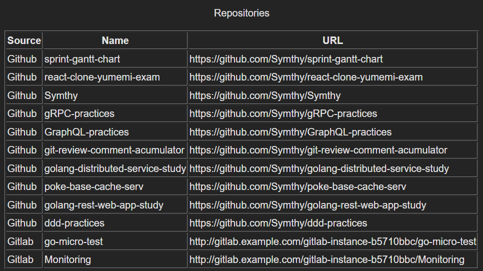

# urql による Github ＆ Gitlab の マルチクライアント 実現（サンプル）

## はじめに

（こんな要件は早々ないだろうが）異なる２つのデータソースから GraphQL によりデータを取得し１画面に表示する

例：Github と Gitlab の両方からデータを取得し、データを統合して画面表示

この例を実現するためのサンプルを記載する

## urql でのマルチクライアントの実現

`useClient()` を使用して client を複数用意しようと思うと、そのうちどの client を使用するか区別する方法がよく分からず。

以下の通り、`useQuery()` のみを使い、複数のカスタムフックを用意してあげれば、マルチクライアントを実現できる。

ref: [urql - multiple clients (Github Discussions)](https://github.com/urql-graphql/urql/discussions/1523#discussioncomment-575307)

注意点 (上記リンクにも記載されているが見落としやすいので記載)：

- useQuery の引数の context はメモ化していなければ Too-many rerender の原因になる
- urql のソースを見れば分かるが、context は useCallback の依存配列にセットされるため
  https://github.com/urql-graphql/urql/blob/a1c0d68cd28fbbc0592119ae6d83d9b85a1c644d/packages/preact-urql/src/hooks/useQuery.ts#L147

```typescript
import { useMemo } from "react";
import { AnyVariables, useQuery, UseQueryArgs, UseQueryResponse } from "urql";

const buildContext = (url: string, accessToken: string) => {
  return useMemo(() => {
    return {
      url: url,
      fetchOptions: {
        headers: {
          authorization: `Bearer ${accessToken}`,
        },
      },
    };
  }, []);
};

export const useGithubQuery = <
  Data,
  Variables extends AnyVariables = AnyVariables
>(
  args: UseQueryArgs<Variables, Data>
): UseQueryResponse<Data, Variables> => {
  const context = buildContext(
    "https://api.github.com/graphql",
    import.meta.env.DEV ? import.meta.env.VITE_GITHUB_TOKEN : "" // 仮
  );
  return useQuery<Data, Variables>({
    ...args,
    context,
  });
};

export const useGitLabQuery = <
  Data,
  Variables extends AnyVariables = AnyVariables
>(
  args: UseQueryArgs<Variables, Data>
): UseQueryResponse<Data, Variables> => {
  const context = buildContext(
    `${import.meta.env.VITE_GITLAB_URL}/api/graphql`,
    import.meta.env.DEV ? import.meta.env.VITE_GITLAB_TOKEN : "" // 仮
  );
  return useQuery<Data, Variables>({
    ...args,
    context,
  });
};
```

## 実例

クエリ：

```typescript
const GET_GITHUB_REPOSITORIES = gql`
  query ($owner: String!) {
    user(login: $owner) {
      repositories(last: 10) {
        nodes {
          name
          url
        }
      }
    }
  }
`;

export const GET_GITLAB_PROJECTS = gql`
  query ($groupFullPath: ID!) {
    group(fullPath: $groupFullPath) {
      id
      name
      projects {
        nodes {
          name
          webUrl
        }
      }
    }
  }
`;
```

コンポーネント：

```typescript
export const GitRepositories = () => {
  const [githubResult, reexecuteGithubQuery] = useGithubQuery<RepositoryData>({
    query: GET_GITHUB_REPOSITORIES,
    variables: {
      owner: "Symthy",
    },
  });

  const [gitlabResult, reexecuteGitlabQuery] = useGitLabQuery<Group>({
    query: GET_GITLAB_PROJECTS,
    variables: {
      groupFullPath: "gitlab-instance-b5710bbc",
    },
  });

  const {
    data: githubData,
    fetching: githubFetching,
    error: githubError,
  } = githubResult;
  const {
    data: gitlabData,
    fetching: gitlabFetching,
    error: gitlabError,
  } = gitlabResult;
  /* 以下仮実装 start */
  if (githubFetching || gitlabFetching) return <p>Loading...</p>;
  if (githubError) {
    return <div>An error occurred! {githubError.toString()}</div>;
  }
  if (gitlabError) {
    return <div>An error occurred! {gitlabError.toString()}</div>;
  }
  /* end */

  const githubRepositories = githubData?.user.repositories.nodes.map((repo) => {
    return {
      ...repo,
      source: "Github",
    };
  });
  const gitlabRepositories = gitlabData?.group.projects.nodes.map((repo) => {
    return {
      name: repo.name,
      url: repo.webUrl,
      source: "Gitlab",
    };
  });

  const repositories: { name: string; url: string; source: string }[] = [];
  if (githubRepositories) {
    repositories.push(...githubRepositories);
  }
  if (gitlabRepositories) {
    repositories.push(...gitlabRepositories);
  }

  return (
    <>
      <p>Repositories</p>
      <table border={1}>
        <thead>
          <tr>
            <th>Source</th>
            <th>Name</th>
            <th>URL</th>
          </tr>
        </thead>
        {repositories.map((repo) => (
          <tbody>
            <tr>
              <td align="left">{repo.source}</td>
              <td align="left">{repo.name}</td>
              <td align="left">{repo.url}</td>
            </tr>
          </tbody>
        ))}
      </table>
    </>
  );
};
```

表示結果：



## 補足

Gitlab は docker で立てることができる

```shell
docker run --detach \
  --hostname gitlab.example.com \
  --publish 443:443 --publish 80:80 --publish 22:22 \
  --name gitlab \
  --restart always \
  --volume $GITLAB_HOME/config:/etc/gitlab \
  --volume $GITLAB_HOME/logs:/var/log/gitlab \
  --volume $GITLAB_HOME/data:/var/opt/gitlab \
  --shm-size 256m \
  gitlab/gitlab-ce:latest
```

ref: https://docs.gitlab.com/ee/install/docker.html
