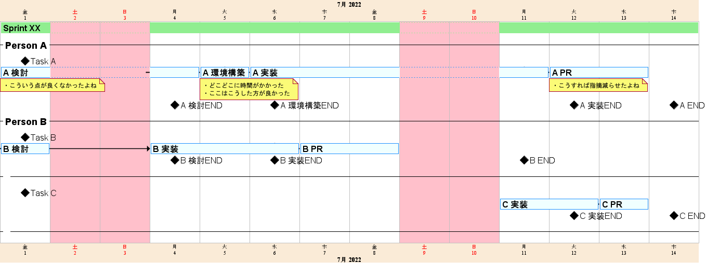

# PlantUML ガントチャート を活用してスクラムでのプチ進捗管理を行い見える化を進めたい

## 背景/前提

- 立ち位置：2 次請け側、プロダクト開発案件に自社が１サブチーム(6~7 人)として参画（＝プロダクトを行っている会社が我々から見れば顧客）
- スクラム開発。1 Spint 2 週間。
- メンバーの実力が低く、頭２つ３つ抜けてる１人(私)がカバーに入らざるを得ない状況が毎 Sprint 簡単に起きている
  - 他メンバーのカバーに(私の)リソースが割かれすぎている
    - 私しかできない重いタスクに数日程集中せざるを得なくなり、カバーにあまり入れなかった際に、明らかに一部メンバーの進捗が悪くなった
    - 毎月残業上限ギリギリで、改善等に回せるリソースが残らない
    - 毎 Sprint でチームとしてこれだけのタスクやりますと顧客と交わしている以上、チームとしてそれに対する成果(タスク完了)を出さなければならない。カバーに入らなければ 1 sprint でこなす予定のタスクが終わらない(それでも毎回若干はみ出しているためなんとも…)
      - 放っておいて(というよりは必要に応じて適度かつソフトな支援を行う)で進むならわざわざ介入したりはしない。
      - マイクロマネジメントにならないように、悪い点を指摘するのではなく次に繋げるように伝えるよう心掛けているが、できてない部分はあると思われる。
  - 根本の解決にはメンバーの実力の底上げが必要だが、それがひどく難しい状況。
    - 週 1 で 30 分勉強会を 1 年近く(7,8 割私主導で)開催し、知識の共有を図っていたが、それが無駄という判断をせざるを得ない状況に追い込まれ、止める決断をした程
    - 外部でうまくいった事例を適用できれば確かに向上ができそうと思っても、組織/体制的に適用が困難だったりするため、有効な手立てが見つからない状況から脱せず
- 実力底上げが困難と判断している、かつ悪循環が起きている以上、別方面から何かしら手を打たなければならない
  - カバーに入らざるを得ない状況に追い込まれるのは必然(そう簡単に解消は無理)と割り切った上で、それを少なくする、もしくは先回りして潰して、時間を減らす必要がある
- 現状何が悪いのか？何に多くの時間が掛かっているのか？そこの特定がしきれていない
  - 毎 Sprint 各々の振り返りが浅いままで終わっている
  - 聞いていて引っかかった所は質問を投げて深堀を試みるが、見えてない/気づけてない物は多分拾えていない
  - 一番深堀できる人(私)が、見えてない/気づけてないから、深堀しきれずに終わってる（他メンバーよりできるだけであって、うまいとは言っていない）

故に全体の見える化をする必要がある。

ガントチャートなりで予実績の記録＋ α を行い、記録を徹底する必要があると考える

## PlantUML のガントチャートを使ってみる

ツールを導入したり等できるなら、そうしたいができないので、図を作ってまずは全体の俯瞰視ができるようにする。

図を作るものとしての候補は、

- PlantUML
- Mermaid

最近は、Github 等の色々なサービス が Mermaid をサポートし、Mermaid の方が注目を浴びているように感じる。

見た目だけで言えば、個人的には、Mermaid > PlantUML だし、純粋なガントチャートが作りたいなら Mermaid で良かったんだが、作りたいのは、純粋なガントチャートではなく…

PlantUML の方が頭の中でイメージしていたものに限りなく近いものが作れるため、PlantUML を選択。

以下が、考えた雛形。（タスクを１列に並べたり、付箋(note)付けるのは PlantUML でないとできない）



以下ソース。

```
@startgantt
language ja

printscale daily zoom 6
<style>
ganttDiagram {
	task {
		'FontColor red
		FontSize 16
		FontStyle bold
		BackGroundColor Azure
		LineColor DodgerBlue
	}
	milestone {
		'FontColor blue
		FontSize 16
		'FontStyle italic
		BackGroundColor black
		LineColor black
	}
	note {
		FontSize 12
	}
	arrow {
		LineColor black
	}
	separator {
		FontSize 18
		FontStyle bold
		FontColor black
	}
    timeline {
	    BackgroundColor AntiqueWhite
	}
	closed {
		BackgroundColor pink
		FontColor red
	}
}
</style>

Project starts 2022/07/01
saturday are closed
sunday are closed
'2022/xx/xx is closed
'2022/xx/xx to 2022/xx/xx is closed

[Sprint XX] lasts 2 weeks
[Sprint XX] is colored in LightGreen
[Sprint XX] links to [[http://example.com]]

'[Task 1 (1日)] lasts 1 day
'[T2 (5日)] lasts 5 days
'[T3 (1週間)] lasts 1 week
'[T4 (1週間と4日)] lasts 1 week and 4 days


-- Person A --

'Task A
[Task A] happens at [Sprint XX]'s start
[A 検討] lasts 2 days
note bottom
・こういう点が良くなかったよね
end note
[A 環境構築] lasts 1 days
note bottom
・どこどこに時間がかかった
・ここはこうした方が良かった
end note
[A 実装] lasts 4 days
[A PR] lasts 2 days
note bottom
・こうすれば指摘減らせたよね
end note

[A 検討] -> [A 環境構築]
[A 環境構築] -> [A 実装]
[A 実装] -> [A PR]
[A 環境構築] displays on same row as [A 検討]
[A 実装] displays on same row as [A 検討]
[A PR] displays on same row as [A 検討]

[A 検討END] happens on 2022/7/4
[A 環境構築END] happens on 2022/7/6
[A 実装END] happens on 2022/7/12
[A END] happens on 2022/7/14
[A 実装END] displays on same row as [A 検討END]
[A 環境構築END] displays on same row as [A 検討END]
[A END] displays on same row as [A 検討END]

-- Person B --
'Task B
[Task B] happens at [Sprint XX]'s start
[B 検討] lasts 1 days
[B 実装] lasts 3 days
[B PR] lasts 2 days
[B 検討] -> [B 実装]
[B 実装] -> [B PR]
[B 実装] displays on same row as [B 検討]
[B PR] displays on same row as [B 検討]

[B 検討END] happens on 2022/7/4
[B 実装END] happens on 2022/7/6
[B END] happens on 2022/7/11
[B 実装END] displays on same row as [B 検討END]
[B END] displays on same row as [B 実装END]

-- --
'Task C
[Task C] happens at [Sprint XX]'s start
[C 実装] pause on 2022/7/1 to 2022/7/8
[C 実装] lasts 2 days
[C PR] lasts 1 days
[C 実装] -> [C PR]
[C PR] displays on same row as [C 実装]

[C 実装END] happens on 2022/7/12
[C END] happens on 2022/7/14
[C END] displays on same row as [C 実装END]

-- --

@endgantt
```

## ツールを作ればいい

これを手書きで作るのは面倒なため、python + jinja2 等で、雛形生成ツール的なものを作ればよさそう。

追記：4 時間程で作った https://github.com/Symthy/sprint-gantt-tmpl-builder

GUI 操作のみで容易に編集可能にできれば、もっと楽になるとは思う。ガントチャート＋ α なフロントエンドアプリでも作れればと思うが、フロントエンドアプリ開発は勉強中のため、やるにしてもそれは大分先の話になるだろう。

外部ツールが使えない/適当な物がなければ、まずは自身のできる範囲でできること（ツールなり作る）をすればいい。効率化/課題解決はエンジニアの腕の見せ所

## さいごに

前提を書いていて虚しさみたいな物が込み上げてきて辛かったが、自身が立ち向かおうとしている物や現状を正しく認識するためにも言語化は必要

いつかは抜け出すことを画策しているとしても、今のこの逆境に真向から立ち向かう（自身が向き合いたいものと違ったとしても）。その姿勢と取り組みはきっと次に繋がると信じて。
