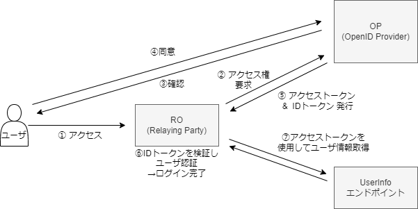

# OpenID Connect 概要まとめ (In progress)

随時追加

## OIDC イメージ

OIDC = OAuth + IDトークン + UserInfoエンドポイント

- IDトークン：認証
- アクセストークン：認可用（有効期限は短い）
- リフレッシュトークン：アクセストークン更新用（有効期限は長い）

## Link Stack

[SpeckerDeck - 30分でOpenID Connect完全に理解したと言えるようになる勉強会](https://speakerdeck.com/d_endo/30fen-deopenid-connectwan-quan-nili-jie-sitatoyan-eruyouninarumian-qiang-hui?slide=47)

[IDトークンが分かれば OpenID Connect が分かる](https://qiita.com/TakahikoKawasaki/items/8f0e422c7edd2d220e06)

[OAuth 2.0 / OIDC を理解する上で重要な3つの技術仕様](https://logmi.jp/tech/articles/322822)

[OpenID Connect セッション管理 概要](https://qiita.com/KWS_0901/items/b554af751156e637a15f)