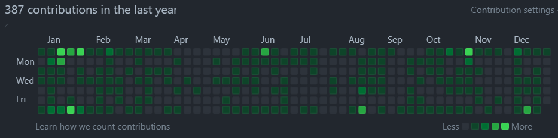

# 2022 振り返り

2022 年を振り返る

- アウトプット
- 業務面＆個人面
- 2023 年の目標

# アウトプット面

３年目了。なんだかんだ１年に１回は振り返りを行ってはやり方や使用媒体を変更し、多少なりとも改善を図っている。

## １年前の改善事項

今回どうするかを触れる前に１年前を振り返る。

１年前は、以下自身のドキュメント管理用ツール（以降、個人ツールと記載）を作ってしまえと考え、2022 年頭に開発して１年間はこれを使ってきた。

[https://github.com/Symthy/docs-and-blog-enty-manager](https://github.com/Symthy/docs-and-blog-enty-manager)

作った経緯：[個人用ドキュメント＆ブログ管理ツール(ガチめ)作成記](https://symthy.hatenablog.com/entry/2022/01/23/192229)

（上記ツールにより「管理」という煩わしさからある程度解放されたことによる恩恵かはわからないが）アウトプットについての自身のスタイルのようなものがようやく見えてきた。

## 今回の改善事項

VSCode× 自作ツールを使う中で、いくつかの気づきがあった。

- VSCode よりは Notion の方が書き味がいい（というよりは書いたものがそのまま見た目になるため見やすい。Markdown で書くとプレビュー表示が必要になる）
- ある程度自動化したとはいえ、ちょっとした小さいものを書くには VSCode ＋自作ツールではまだ敷居（というよりは多少の煩わしさ）を感じている。
- それ故か、色々記事を見たりして、Twitter ではリツして疑似ピン留めや、はてなブックマークで後で読むに入れる等しているが、それらはそれ限りで埋もれ OUTPUT に繋がっていない（自作ツール導入により解決を期待したができていなかった）

一度 Notion の使用をやめようと思ったが、Notion のデータベース機能が何かを Stock していくには便利である点。

そこで、個人的な目標としている INPUT:OUTPUT ＝ 1:1 以上 を成立させるためにも、以下の「Link Stock」テーブルのようなスタイルで、気になった or 調べて見つけた記事等を（URL と Summary 記載の上）Stock していくのが良いと考えた

[https://protective-metatarsal-484.notion.site/Link-TechTips-Stack-bbcc6dfc9bd44256afc542cf9858ad52](https://www.notion.so/Link-TechTips-Stack-bbcc6dfc9bd44256afc542cf9858ad52)

また、Notion を再度利用するにあたっては以下を参考にし、個人技術メモの導入と、タグライブラリーを導入することとした。

- [エンジニアが自分用の小さな技術メモを残すべき理由と Scrapbox の紹介](https://phys-and-program.com/entry/2022/08/01/145204)
- [Notion でタグライブラリーを作るとめちゃくちゃ捗った](https://note.com/ko_nyaku/n/nbb0355b099ba)

そうすると、今度はブログをどう使うかが曖昧になってしまったが、以下のような使い分けをするのが良いと考えた。

- Notion：個人技術メモや気になった記事など、個人的に Stock しておきたい小さな知識を溜めておく場とする
- ブログ：以下のように何かについてまとめた、ある程度大きいものを投稿する場とする
  - [【gRPC】Connect が作られた背景概要／これまでの gRPC-Web／Connect でできること](https://symthy.hatenablog.com/entry/2022/09/24/160309)
  - [某社フロントエンドコーディング試験を題材とした React 学習記（作成時の考慮事項まとめ）](https://symthy.hatenablog.com/entry/2022/11/08/001801)

たまたま、上記 Connect の記事を書いたことで、自身のアウトプットのスタイルとして何かを小出しにするよりも調べまくってまとめて１つのでか物を出す方が性に合っていると認識した。

Notion に個人的なメモを溜め何か１つのテーマについて記事を書く際にそのメモを材料にしつつまとめてブログにアウトプットするというのが現時点で考える理想の形である。

## 個人ツールの今後についてのアイディア

追加したい機能はいくつかあり、優先度的に後回しになりがちではあるが

[obsidian](https://obsidian.md/) との併用をできるように改修を行うのが良さそうに思っている。

obsidian のベースとなっている手法/考え方を理解する必要があるが、その一部に個人ツールの根底にある考えと重なる部分もあること、取り入れることで記事数が多くなった際に個人ツールで衝突するであろう課題も解消できると共に、ツールをより昇華させれると考える。

Obsidaian 参考

- [Obsidian がすごくいい](https://zenn.dev/usagizmo/articles/beb73159edbe68)
- [Obsidian でつなげる情報管理術 (本)](https://www.amazon.co.jp/dp/B0B4K499F4)
- [Obsidian.Zenn 次世代のノートテーキングツールである Obsidian を使って Zenn で記事や本を作ろう!](https://zenn.dev/estra/books/obsidian-dot-zenn)
- [コーディングのようにノートを取る技術](https://qiita.com/YUM_3/items/e95dfba66d6150903462#obsidian)
- [Zenn & Hugo in Obsidian : OHZ フローによるナレッジベースとアウトプットコンテンツの完全統括](https://zenn.dev/estra/articles/ohzflow-zenn-hugo-obsidian)
- [標準機能でも便利な「Obsidian」をプラグインで使いやすくする](https://gihyo.jp/article/2022/12/obsidian-02)

# 業務面＆個人面

## これまでと 2022 年

3 年前の転〇活動でどん底な現状を認識し、3 年かけてでも再起すると誓い、その 3 年が経過した今。業務面の目標、そして最低限ではあるが個人面での目標をクリアした。

- 業務面
  - １つ以上自身の実力でもって自身に自信を持てるだけの成果を作る ⇒ 達成
    - 数少ないチャンスを掴み取って遂に今年達成した（しかも２つ作れた）
- 個人面
  - 自身で方針等を考えて開発する ⇒ 達成（２つ：個人ツールと某社フロントエンド試験）
  - ポートフォリオを作る ⇒ 未達成（失敗のため再設計＆再計画中）
    - [PokeRest 設計＆今後の方針 【執筆中】](https://symthy.hatenablog.com/entry/2022/11/27/225949)

業務面での成果は、この３年間色々な技術要素に触れ学び、技術力や対応力等を地道に上げ続けたからこそ達成できたと思う。たかが３年されど３年。今度は専門性を築くためにもまだまだ研鑽を積む必要がある。

個人面では、今年は主に以下２つの学習を進めた。

- Golang （ポートフォリオ開発で使用）
- React

（他に細かいものを上げると gRPC、GraphQL、AWS 等も）

React はまだ学習が必要だが、某社フロントエンド試験を題材とした学習/開発を通して、自身で企画したものを(時間はかかるだろうが)作り上げる自信が付いたのは個人的に大きな収穫であった。

Golang に関してもポートフォリオ開発には失敗しているものの、そのために Golang を半年近く触り続け多少なりとも理解が進んだことが業務の成果に繋がったことは何よりも大きかった。

今年(2022/12/30 時点)の Github は以下の通り。（これを見て振り返ると業務高負荷により何度かプチバーンアウト(特に 4~5 月が酷かった)を起こしたり今年も体重をロストして過去最低更新する等散々だったなぁと…）

## 2023 年目標

なんとなく目指したい方向も見え、そこを目指すためにも、更に技術力等を上げるためにも

- 転〇し、次なるスタートを切る

これは絶対条件。また React 学習を優先したため後回しにした

- AWS 学習（資格取得）

また、技術面に関しては次なるスタートのためにもポートフォリオ開発のため以下の学習が中心となると思われる。

- Golang 強化
- アーキテクチャ、マイクロサービス
- GraphQL
- etc.

そして、引き続きポートフォリオ開発を進める。現在開発中のものは構想も大きいため今考えているものだけでも数年がかりとなると推測しているが地道に進めていく。加えて業務の改善と個人的にも欲しいためにもう１つ 2023 年に開発を行う。

他にも細かいことを上げれば色々あるが、転〇先によってこの辺りは変わるだろう。なによりもまずは転〇のため今できることを全力で行おう。

たとえ進む速度が遅くとも地道に足掻き続けるしか道はない故にその道を行く。

以上
