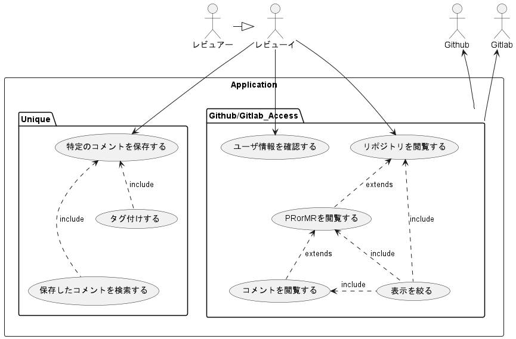
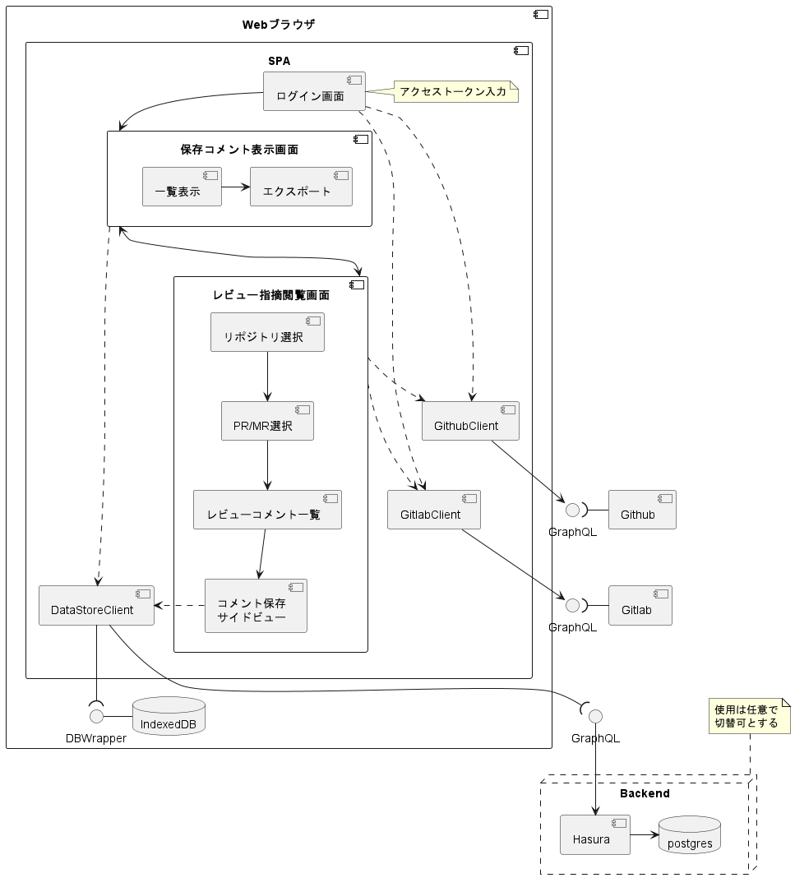

# Git Review Comment Acumulator 企画/設計

## 背景

チームメンバーの技術力や自走力の低さが根底の問題として存在している。

一時期、その解消目的で私が 7 ～ 8 割り主体で勉強会を開催していたが、一方通行ではうまくいかず（全く結果に結びつかず、やるだけ無駄という判断を下さざるを得なくなった）、止めた。

代わりとなるものを探していたが、中々良いものが見つからなかった

他でうまくいっている方法として、読書会や業務で使えそうなツールを探して共有等の方法があるが、制約が大きいこともありやろうとはならず。

ただ、他でうまくいっている方法をいくつか見る中で、共通点はアウトプットサイクルを回すことだと推測した。

恐らく外でそのための題材やアイディアを探しても、現環境に適用できるものは見つからないと見切りをつけ、内部にアウトプットサイクルを回せる題材がないかと探した。

それで辿り着いたのが、コードレビューの指摘であった。

コードレビュー指摘であれば毎 Sprint 誰かが何かしら指摘をもらう。それを次に繋げるためにどうすればよいかを考え調べ振り返ってもらうだけでなく、チームメンバーにも共有することでアウトプットし、(恐らく主に私が行うことになるが)何かしらのフィードが行えれば、アウトプットサイクルを構築できると考えた（更に指摘が特定の人以外に共有されないという問題も一緒に解決できると踏んでいる）。

だがそこには障害があり、コードレビューの指摘(PR のコメント)を収集するには多少なりとも時間がかかることから、そこに各メンバーの時間を使わせたくないと、上司に巻き取られるも行われず自然消滅させられた。

裏を返せば、コメント収集が簡単に行われれば実行可能であると判断。

過去に python で Github からコメントを収集するための CLI ツールを作るも、開発環境面の問題から実行に多少の敷居があるために誰にも使われず。

故に、GUI ツールを作るしかないため、ブラウザで使えるよう Web アプリ(SPA)を作れば敷居０にでき、実行に移せると考えて開発を行うこととした。

## 要件

- 画面で容易に操作できる（CLI では使われない）
- Github と Gitlab による差異は最小限にし共通のインターフェースとしたい
  - Github のみ、Gitlab のみを使用している環境でも使える
- Github の PR と Gitlab の MR の両方からコメントを取得＆閲覧できる
  - 所属する組織の Github と Gitlab の両方のリポジトリの一覧が見れる
  - 両方から複数の PR/MR を複数同時選択して閲覧したい
  - Github の PR の Conversation のようにコメント対象ソース周辺もセットで見れる
  - 特定のコメントに対してメモを付けてストックできるようにしたい
    - ストックしたものは保存でき、いつでも閲覧できるようにしたい
    - ストックする際にカテゴリ等で分類できるようにしたい
    - ストックしたものを検索できる、言語別にも見れる
  - 収集するコメントはフィルタリングできるようにしたい
    - PR/MR 作成者、レビュー者など
- Web ブラウザのみでも使用可能とする

## 設計

リポジトリ、PR/MR、コメントの情報取得には以下を利用する（どちらも同様の情報が取得できそうである）

- [Github GraphQL API](https://docs.github.com/ja/graphql)
- [Gitlab GraphQL API](https://docs.gitlab.com/ee/api/graphql/)

大まかな構成は以下の通り。

データ(ストックするコメント)の保持は以下のような方針とする。

- Web ブラウザのみで使用できるよう、データはブラウザ上で保持する（保存先候補：IndexedDB）。
- データはインポート/エクスポートできるようにする（データが飛ぶ可能性があるのでユーザに保持してもらう）。
- 上記が面倒なユーザのために、バックエンドを提供する（Docker で環境提供してユーザの環境で立ててもらうことを想定）。バックエンドを使用するか否かはユーザが自由に選択できるようにする。

SPA 開発には React を使用する。

- GraphQL クライアントとして、まずは graphql-request または urql を使用予定
- バックエンドをサポートする際は ApploClient の使用を検討する（それまではオーバースペック）
  - 参考：[あなたのプロダクトに Apollo Client は必要ないかもしれない](https://user-first.ikyu.co.jp/entry/2022/07/01/121325#Apollo-Client-%E3%81%8C%E5%90%91%E3%81%84%E3%81%A6%E3%81%84%E3%82%8B%E3%82%B1%E3%83%BC%E3%82%B9)

## 開発計画

まずは、Github と Gitlab から 指定した PR/MR からコメントを取得して表示できるようにする（これをできるようにするにするだけでやりたいことは実施できるため）。

そこから、ユーザビリティ向上のため、複数 PR/MR から一括でコメントを取得/表示できるようにし、
ストックしておきたいコメントを保存＆エクスポート/インポートできるようにしていく（他にも追加した方が良いものが見つかれば追加していく）。

バックエンドのサポートは最後の予定とする。

個人的には、このアプリから Github/Gitlab のレビュー＆コメント投稿をできるようにすれば、今後参考になる/なりそうだとストックしておいた過去の指摘を素早く引き出して、そのまま流用するといったことができるようになり、多少レビューのスムーズ化に繋がったりしないかと妄想している（やってみなければ分からないし、やるなら他との明確な差別化が必要と思われる）。

[リポジトリ](https://github.com/Symthy/git-review-comment-acumulator)
