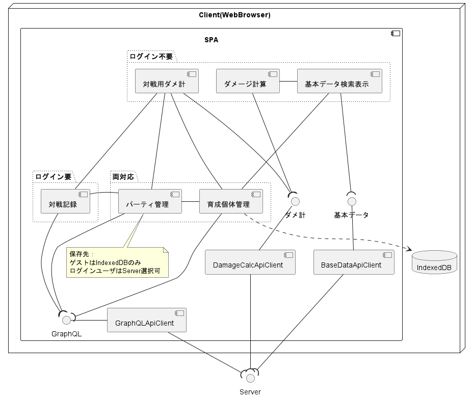
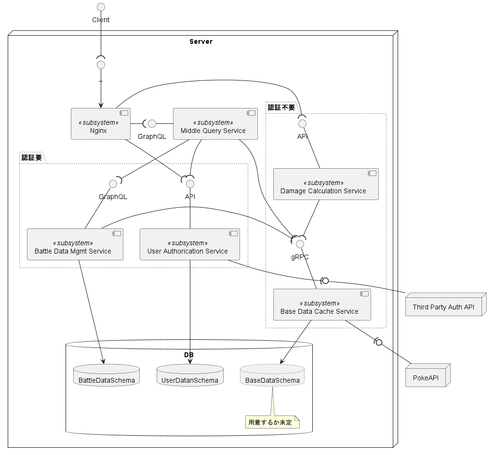
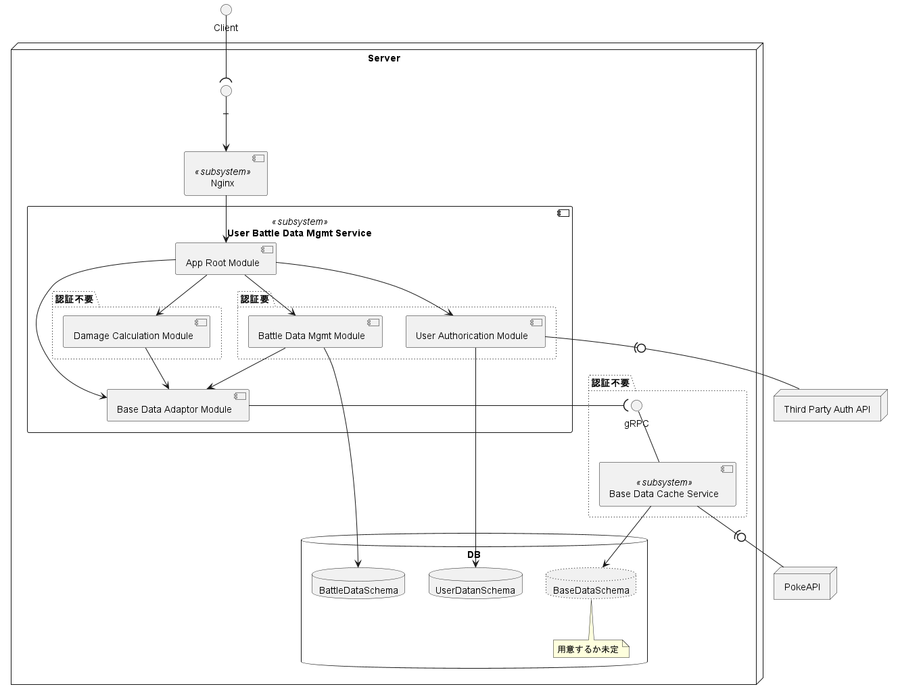
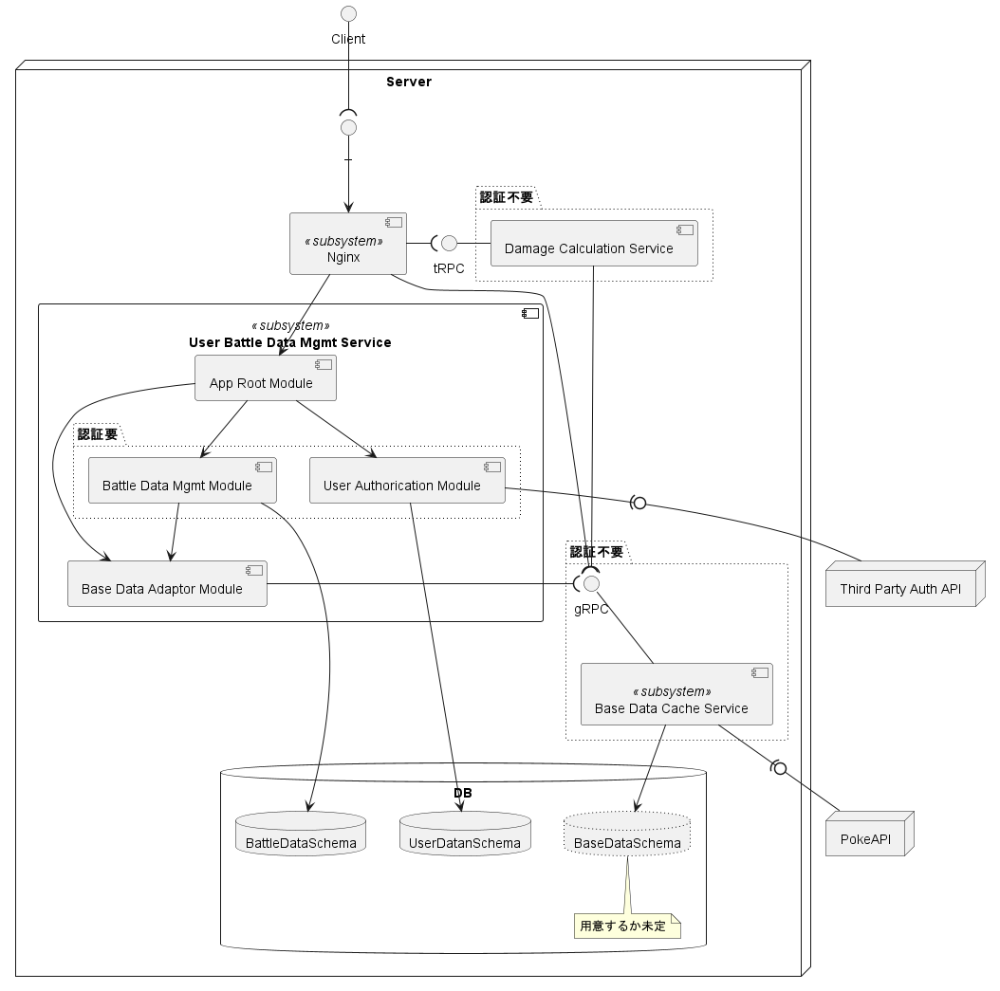

# Poke Battle Integration App 再設計＆今後の方針

旧名：PokeRest から改名（リポジトリ：https://github.com/Symthy/poke-battle-data-mgmt-serv）

ポ〇モン対戦のためのサービス開発

半年近くに渡っての開発での失敗、それを踏まえての構成再設計＆今後の方針を定義。合わせて何に立ち向かうのかを記載する。

## 背景/向き合う課題

ポ〇モン対戦は、シンプルなように見えて実に奥が深く、調整次第では(限度はあるが)相性の有利不利を覆すことが可能なのは魅力の１つではないかと思う。

元１プレイヤーとして感じている課題は色々あるが、ここでは個人的に感じているものかつ今回主に焦点を当てるものに留める。

ポ〇モン対戦に関する現状感じている課題

- ツールがバラバラ ※スマホアプリであれば複数兼ねているものもある

  - 図鑑（タイプ、種族値、覚える技などの基本情報）
  - ダメージ計算
  - 育成個体管理
  - パーティ管理
  - etc.

- 1 ターンの持ち時間 45 秒 の短い間で考えることが多い

  - その判断材料に「ダメージ量」は重要なファクターの１つ。(上位プレイヤーでも場面によっては正確性のためにダメージ計算を行う程)
    - ダメージ計算を行うには必要な項目が多くあり、慣れた人でも (ツール使用で) 20 秒前後は要しているように感じる
    - 練度が足りない人は、45 秒あっても足りない場合も…

- 火力調整、耐久調整を細かくやろうと思うと、多くのダメージ計算を回す必要がある

  - 自身で調整を考える際、基本的には対応範囲を広くするためにも、複数の仮想敵に対して火力/耐久ラインの調整を行う。
  - つまり、1 vs 多 の計算を行う必要がある。
    - 大体のダメージ計算ツールは 1 vs 1 形式（知る限りでは良くて 1 vs 2 まで）。
    - 1 vs 多のものはないため、1 vs 1 形式に都度入力値を変えながら調整を考えるのが現状。

- 1 試合 1 試合を記録し、分析できるようなツールは(恐らく)ほぼない

  - パーティ構築するには環境を知り、タイプ相性以上の個々の相性を知り、自身のパーティについて知り、上位を目指すなら流行りを知る、など研究/分析要素がある。
  - 猛者は対戦をこなして環境や自分でパーティの弱みを見極めて改善を行うが、初心者には敷居が高い

- 1 シリーズ（１ヶ月）終了毎に、それなりの方が投稿する(パーティの)構築記事を書く手間は大きい
  - パーティコンセプト、それぞれの個体の調整意図や仮想敵、基本選出、動かし方 etc.

## 要件とアプローチ

ざっくり箇条書き。

- 1 つのツール(サービス)で、パーティ構築～対戦までが全て完結すること。概ね必要になるのは以下
  - 基本情報の参照・検索
  - 育成のための調整（それに必要となるダメージ計算）
  - (調整 or 育成済み)個体＆パーティ管理
  - 対戦時のダメージ計算
  - パーティと戦績の出力
- 調整を考えるための過程を(可能な限り)スムーズにする
  - 基本情報参照中の(気になった)ポ〇モンに対して(情報引き継いで)ダメージ計算にシフト可能
  - 1 vs 複数の同時ダメージ計算を可能にする
- 調整したものをそのまま登録できる、パーティ登録もできる
  - ダメージ計算の結果もセットで登録できる
  - 登録した個体からパーティを編成できる。コンセプト等追加情報を記録できる
  - 個体の有利不利を記録できる。パーティ全体の有利不利ポ〇モンを俯瞰視できる
  - パーティメンバーの一部入れ替えを行う際、元のパーティを継承できる
  - 登録したものはエクスポートできる
- 対戦時のダメージ計算を(可能な限り)短縮する（それにより対戦中１ターンの考察時間を増やす）
  - 登録した個体やパーティの情報を引き継いでダメージ計算を行える
  - 相手の場に出ているポ〇モンだけでなく、控えのポ〇モンに対しても同時にダメージ計算ができる（= 1 vs 6 の計算が実施可能）
  - 入力を最小限で済むよう調整のデフォルトセットを用意する（とりあえずざっくり計算したい時に１クリックで調整の指定を可能にする）
- 対戦結果を記録できる
  - ダメージ計算で入力した自パーティと相手パーティをそのまま記録できる
  - パーティの戦績として記録可能、エクスポートもできる
  - 対戦結果から得意・不得意の傾向分析ができる
  - (可能なら) 環境(どのポ〇モンのどういった型が多いか)分析ができる

まとめると、

- 登録/入力したものは引き継いで使用可能（例：個体やパーティ → ダメージ計算）にしたり、入力補助を行うことで入力の簡素化
- パーティ構築の過程(調整検討など)～結果(戦績)までを記録できるかつ、それを出力できる(構築記事の一部にそのまま使えるのがベスト)
- (どこまでできるかは分からないが) 自パーティの分析や環境の分析が行える

## 設計

### これまで（失敗）

主だった失敗点としては以下の通り。

- サーバサイドをモノリスで作ろうとしたこと
- 転〇時のポートフォリオにしようとし、作ることを急ぐあまりテストを疎かにしたこと
- 機能単位ではなく部品単位で作っていたがために全体から見ると中途半端になっていること
- 動く状態にない
- REST API サーバとして開発していたが、API がユースケースベースに寄っていて設計に歪みがある
- ベースとなるデータを最初から DB に入れることを考えていたが、ある１テーブルだけで凡そ 50 ～ 100 × 1000 (= 5 万～ 10 万) レコード必要。それに加えてユーザの各種データを持つとなると個人開発でリソースが限られるために厳しく、それに対する対策を出せなかったこと

そもそも何故こんな自体になったのか。

時間がない中、転〇時のポートフォリオにしようという焦りから
完成させるに至らずとも、テストを後回しにしてでも土台となる部分と一番メインとなる機能を作り切り、転〇活動をしながら各 API の実装とテストを進める

という歪んだ方針で開発を押し進めた結果、総 Step 数が１万を越えた辺りから、開発のしづらさを感じた出したことと、上記案図のように分割した方が良いのではないかという考えもあり、完成まで現状の２～３倍実装する必要があるというのがなんとなく見えているが、完成後にサービスを分割するのか？という迷いと、このまま押し通してリリースにこぎつけたとしても機能追加をスムーズに行えない未来がなんとなく見え、モチベーションが続かなくなり失速して頓挫した。

そのため、一度距離を置くとともに、当時はフロントエンドを開発できる程の技量がなかったため、後述のフロントエンドとバックエンドを並行して開発できるようにするために、React の学習に半年程費やして、現在（再設計/再計画）に至る。

### 目指す姿（再設計過程）

考える中で二転三転したため、その過程も含めて記載する。

#### 前提とする考え

独立したベースデータを保持するキャッシュサービス（以降、「ベースデータキャッシュサービス」と記述）を用意する

細かい変更点は以下の通り。

- ベースデータに関しては、自身での全て管理するの厳しいため、一旦諦めて外部リソースを頼る => [PokeAPI](https://github.com/PokeAPI/pokeapi)
  - ベースデータの参照頻度には偏りがある（対戦でよく使われるものは参照頻度が高く、それ以外は参照頻度が低い）はず。
  - 全てを均一の速さで取得するよりも、参照頻度が高いものをより速く取得できるようにした方が、ユーザビリティも良くなるはず
  - 故に、ベースデータキャッシュサービスを用意する => 利用 OSS 候補：[go-cache](https://github.com/patrickmn/go-cache)
  - そうすることで、速さだけでなく、頼る外部リソースが仮にダウンしたとしても利用中のユーザをしばらくは救えるはず（それだけでは不完全なため代替手段は用意する必要があると思われるが優先度は低め）
  - ただ、最も要となる部分だが外部に頼るという不安要素も抱えることになる
    - 自身でベースデータを管理する算段が立てば、将来的に丸ごとリプレイスする可能性もある。
    - そうなった場合にも、運用を継続しながらリプレイスを容易に進められるよう、独立したサービスに分ける。
  - ベースデータキャッシュサービスの通信インターフェースは Connect を利用する予定
- 上記以外のユーザデータに関する部分（個体やパーティの情報等）は REST API を止め、GraphQL を使用する
  - 現状がユースケースベースに寄った API であるため、REST では歪なため
  - 今考えているユースケース以外に新たに増えるかもしれないユースケースにも柔軟に対応可能とするため
- ベースデータキャッシュサービスを除いてバックエンドは無くてもフロントエンドのみで利用可能なサービスとする
  - ユーザデータ（個体やパーティの情報等）をどこかに預けず自身で管理したいユーザが一定数いるのではないかと考えているため。また個人開発のためバックエンドが不安定な要素になる懸念があるため、ほぼフロントエンドのみで使用できるようにする必要がある。

#### 構成検討：過程

上記を根底に置き、構成について考えた。バックエンドは２案を検討。

- フロントエンド（共通。詳細はブラッシュアップ予定）

- バックエンド案１：責務毎にサービス分割

サービス指向アーキテクチャに則り、サーバサイドは役割毎にサービスを分割する可用性重視の案。

- バックエンド案２：モジュラモノリスベース

そもそも案１のように細かく分ける必要がないのではないかと考えて出した案。

案１、２共通の部分を除いて評価した。

案１を基準とした時の相対評価（勝る：◎、同等：〇、劣る：△）。項目はひとまずソフトウェア品質特性ベース＋ α で評価（機能性/使用性は評価できないため除外）

| #                | 案 1 | 案 2 | 評価結果の理由                                                                                                                                                                                                 |
| ---------------- | ---- | ---- | :------------------------------------------------------------------------------------------------------------------------------------------------------------------------------------------------------------- |
| 信頼性           | 〇   | △    | サービスが分かれるため一部サービスがダウンしてもその他は継続運用可能                                                                                                                                           |
| 効率性           | 〇   | ◎    | サービス分ける分サービス間で通信が必要になる等サーバの資源使用量は増（可用性向上のためにコンテナ化するとなおさら）                                                                                             |
| 保守性           | 〇   | 〇   | 完成直後はおそらくそれほど変わらないと思われる。規模がそれなりに大きくなれば案１に軍配が上がるかもしれない                                                                                                     |
| 移植性           | 〇   | △    | 単純に別サーバに引っ越しであれば案２の方が分かれていない分容易なように思うが CI/CD の仕組を整えればさほど優劣は付かないと考える。いざというときに分散配置など柔軟に対処が可能なため案 1 に軍配が上がると考える |
| コスト           | 〇   | ◎    | サービスを分ける分実装コストは案 2 の方が大                                                                                                                                                                    |
| リアーキテクチャ | 〇   | ◎    | コスト的に １度バラしたものを統合/再編 ＞ モジュラモノリスを分解/再編 と考える                                                                                                                                 |

(個人開発のためリソースの資源が限られることから) 少なくともバックエンドは 1 サーバに全て入れる予定である。故に、サーバが壊れれば信頼性は 0、かつ 案 2（モジュラモノリスベース）でも、不具合により一部モジュールが機能不全を起こしたとしても、サービスをダウンさせず他モジュールは継続利用可能となるよう作り込めば、案 1 と同等の信頼性は得られるのではないかと推測。

以上より、案２ ＞ 案１と判断する。

#### 構成検討：結論

そこまで考えたところで、１つ考慮が必要な点に気づいた。

- ダメージ計算ロジックは、フロントエンドとバックエンド両方に必要。

1 vs 多のダメージ計算をフロントエンドで行うのは負荷が大きい可能性があり、基本的には(ユーザの環境に依存して性能差があまり出ないよう）バックエンドで引き受けたい。

だが、バックエンドが一時的に利用不可となっても、フロントエンドのみで(可能な限り)サービス利用を可能としたいため、フロントエンドとバックエンド両方に同じロジックを持たせたい。

となると、フロントエンドは TypeScript を用いて開発することから、共通化しようとするとバックエンドも TypeScript である必要がある。

バックエンドのメイン言語は Golang を採用しているが、ダメージ計算ロジックをユーザデータを扱うサービス内に一緒に含める必要があるかというと、ユーザデータと依存関係を持たせる必要がないため、No。

故にダメージ計算用のモジュールを独立させても問題ない ＝フロントエンドとソース共通利用のため独立させる。（※ ダメージ計算用のモジュールには、呼び出す導線は GUI のみ、GUI がある前提の機能である、GUI と密接な関係でも問題ない点から [tRPC](https://trpc.io/docs/quickstart) の利用が良いのではないかと考えている）

結論、案１と案２の間のような構成とすることとした。

## 今後の方針

これまで開発してきた以下ソースについては、不要になる部分もあるが、使える部分も多くある。また、完全ではないが、一部コードの自動生成の仕組みも用意している。

- ソース：https://github.com/Symthy/poke-battle-data-mgmt-serv

まずは、

- ベースデータキャッシュサービスの開発に取り組むとともに
- (過去の失敗を活かすべく) テストによる動作担保に取り組む（特に DB 操作）
- モジュール単位で構成を再編。コード自動生成の仕組強化にも取り組む。

基本的にフロントエンド～バックエンドまでをユースケース単位で開発を進め、できたところから公開する。（公開することを前提に進めてこなかった点への反省と戒めを込めて）

DB に関しては postgresql 使用予定から sqlite に変更予定。postgresql が使える良いサービスが見つかっていない、かつ まずはユーザのデータはユーザに持ってもらうような運用にするため、持つデータは多くない。DB 移行が必要になった際に痛みを伴うが、まずは確実に運用できる形から始める（過去の失敗を踏まえて）。
