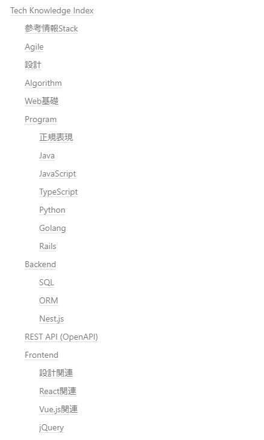
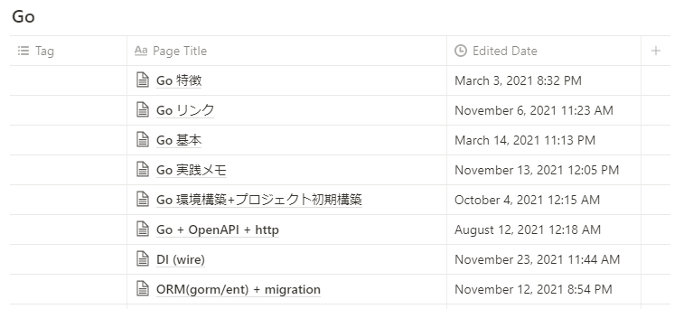
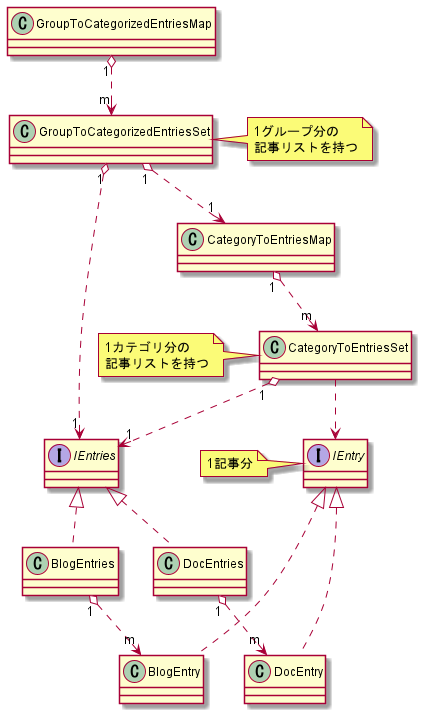
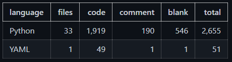
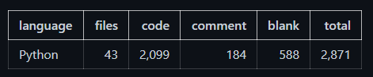

# 個人用ドキュメント＆ブログ管理ツール(ガチめ)作成記

初手、作成物：
https://github.com/Symthy/docs-and-blog-enty-manager

作るに至った背景/作成にあたっての考え/過程等を記す。

## 背景

インプット：アウトプット = 3：7 が良いと言われているが、私自身この比率に全く届いていない所か、1:1にすら届いていない状態。

まずは、最低でも 1:1 にしようと思い始めてから早1年強 、現状(2021年末時)も全く届いておらず。

(業務がずっと残業まみれで時間がないという理由は捨て置き) なぜできないのか？を年末休みに考えた際に天啓が得られたため、思い立ったが吉日で勢い任せにツールを作り始めた。

### なぜアウトプットのモチベがKeepできないのか

これまでの話も交えて記載する。

前提として、「自身専用の最強のメモ帳を作り上げればよい」という考えを根底に持っている。 故に引き出しやすさをかなり重視している傾向が自身にはある。

これまでアウトプット先として、最初はブログ(半年弱程)、次にNotion(1年弱程)を使ってきた。

当時ブログの利用をやめた理由は以下の通り。

- 書いた物を引き出しにくい
- 引き出しやすくするために目次として記事リンク一覧を作っていたが管理が手間であった
- スタイルが完全に自身専用のメモ帳であったため、ブログである必要性がなかった

Notionを利用する事にした理由は、フリーフォーマット故に当時頭でイメージしていた理想形が実現可能であり、使い勝手も良いと感じたため。

Notionは、以下のような形式で利用していた。

- 目次を用意。
  （これが必ず欲しかった譲れない部分。理由は、書いたもの全てを俯瞰視できる状態にしたい、引き出す際にマウス操作だけで目的の物に辿り着けるようにしたいという拘りがあるため。notionのデータベース機能を使わなかったのは↓の目次が作れないため）



- 各カテゴリ毎にテーブルを用意してページを追加する。



という形式で、使用していた。
[実際の物はこちら](https://protective-metatarsal-484.notion.site/SYM-s-Knowledge-Index-fb9cfb0b2ccb46cab20bd95f84ec6c2c)

気付けば1年程が経過し、上記では量が多くなるにつれ以下の問題を感じるようになった。

1. 追加する箇所に遷移するのが多少手間になってきた（デスクトップ版を使っていると目次をクリックしても遷移できないことがあり、スクロールで移動することが多々あり）
2. 一度に別々のカテゴリに複数書き分けたい時に行き来するのが手間になった
3. 人に見せることを意識していないため、まとめ方が雑になってきた
4. 操作ウィンドウを、ブラウザ＋エディターorIDEに加えて、Notion もあり煩わしい（正直２つで押さえたい）

以上を踏まえて、本題のアウトプットのモチベが下げる原因を考えた結果、

- 記事の振り分け等の整理/管理に多少なりとも手間がかかり、面倒になっているからだと気付いた。
    - 故に、書くことに集中できていない。（整理/管理にリソースが割かれる）
    - 故に、モチベが下がる。

そこで、以下のように考えた。

- 作った記事を勝手に整理整頓してくれ、かつ全記事の目次を自動生成する。 そんな仕組みを作ってしまえば、これまでリソースを割いていた整理/管理から解放され、書くことに集中できる。
- せっかくならこれを機に全てmdファイルで書くようにしたい。そうすればアウトプットの利用媒体を変えてたとしても、(原本のmdファイルが手元にあるから)移行がしやすいはず。
- mdファイルで書いたものをコマンド１つでそのままブログなりに投稿できるようにしてしまおう（人目に触れる所に置くことで問題3の解消にも繋げてしまおうという魂胆）。

故に、ツールを作り、記事の整理/管理をツールに丸投げしてしまうことにした。

## ツールの大まかな要件

一応ざっくりとした要件を整理した。

1. 記事(Markdownファイル)を書くことに集中したい
    - 整理/管理に労力を割きたくない -> 自動で整理してくれる
1. 指定した記事をブログへ投稿できる（画像付きでも可能）
1. 1ウィンドウで操作が全て完結したい（例えばVSCodeでのみの操作で完結する)
1. 記事原本は全てローカルで管理したい
    - カテゴリ毎に記事を振り分けて管理したい
    - 振り分けた結果として目次形式で全記事の一覧(リンク付)を出力したい
    - 作成済み記事の(最低限の)検索＆一覧出力もできるようにしておきたい
1. ブログへの投稿も可能にしたい
    - ブログへ投稿済みの記事かどうか把握できるようにしたい
    - ブログにも目次形式で全記事の一覧(リンク付)を投稿したい

ブログ選定に関しては、あまり考えず、以前使っていて親しみがあり、利用者も多く、APIも提供している＆API出の記事投稿でもmarkdown形式に対応していることから、はてなブログを再度利用することとした。

## 要件を満たすための工夫 (設計)

要件満たすためにこうしようと考えた事は、以下列挙の通り。

- 作業用のフォルダと作成済みの記事を格納するマスターフォルダを設ける
    - マスターフォルダに登録する際に自動整理（１コマンドで実行可とする）
- 1記事＝1フォルダとする
    - カテゴリ付与可能とする（そのためにカテゴリ記入ファイルを設ける）
    - 画像格納用のフォルダを設ける
    - 各記事の管理容易化のためidを付与
        - マスターフォルダ登録時に付与（隠しファイルで記事フォルダ内に配置）
        - idの形式はユニークかつ生成が楽な物を選択 -> 日時の数列(yyyyMMddHHmmss)
    - 1記事格納用フォルダ＆付属ファイルはツールで自動生成（１コマンドで実行可とする）
- マスターフォルダから作業フォルダへの取り出しも可能とする（主に再編集時）
    - 取り出し中はバックアップを保持
    - 取り出しのキャンセル(=取り出し前の状態でマスターフォルダに戻す)を可能にする
- カテゴリを束ねるグループを定義するためのグルーピング定義ファイル(*1)を設ける
    - 定義の内容は変更可能かつ、マスターフォルダ下の再構成可能とする
    - この定義に従い、分類した全記事一覧(*2)を自動生成
    - マスターフォルダ下の記事の配置もこの定義に基づいて行う
    - 定義ファイルはyamlを採用（直感的に書けるため）
    - 階層は2階層までとする（分類の複雑化防止目的。必要性を感じたら階層を増やす）
- 記事(mdファイルの内容)をはてなブログへ1コマンドで投稿可能とする
    - 使用している画像もセットではてなフォトライフに投稿する（mdファイル内の画像参照部分は置換が必要なため、それも行う）
    - 記事の上書き投稿も可能とする（画像を更新した場合は画像も再投稿する）
- 記事の情報をjsonで出力/保持
    - はてなブログへの投稿情報や、ローカルの記事とのマッピングもjson出力/保持
    - (*1)に基づき生成した(*2)の結果もjson出力（ツール実行時のデータ再構築と検索処理の容易化目的）
- 記事作成～記事への操作までVSCode等1ウィンドウで行えるようCLIツールとする (*3)

(*1) グルーピング定義は以下のようなイメージ

```yaml
- Program:
    - Golang
    - TypeScript
    - Python
- Web
- Git
- BackEnd:
    - DB
    - SQL
    - ORM
- FrontEnd:
    - UI
    - React
    - Vue
```

(*2) 全記事一覧（目次）は、以下のようなイメージ。

- 記事に付与したカテゴリ名と一致する箇所にぶら下げる
- グルーピング定義に存在しないカテゴリが付与された記事、及びカテゴリ無しの記事は「その他」にぶら下げる
- リンク部分は、ローカル用：記事(mdファイル)への相対パス。ブログ用：記事のURL。

```md
# Table of contents

- Program:
    - Golang
        - [xxx](./xxx/xxx.md)
    - TypeScript
        - [xxx](./xxx/xxx.md)
    - Python
        - [xxx](./xxx/xxx.md)
    - [xxx](./xxx/xxx.md)
- Web
    - [xxx](./xxx/xxx.md)
- Git
    - [xxx](./xxx/xxx.md)
- BackEnd:
    - DB
        - [xxx](./xxx/xxx.md)
    - SQL
        - [xxx](./xxx/xxx.md)
    - ORM
        - [xxx](./xxx/xxx.md)
    - [xxx](./xxx/xxx.md)
- FrontEnd:
    - UI
        - [xxx](./xxx/xxx.md)
    - React
        - [xxx](./xxx/xxx.md)
    - Vue
        - [xxx](./xxx/xxx.md)
    - [xxx](./xxx/xxx.md)
- Others
    - XXX
        - [xxx](./xxx/xxx.md)
    - [xxx](./xxx/xxx.md)
```

(*2)を生成するためのコアのクラス構成は以下のようなイメージにした。(2022/1/23時点:一部失敗し以下の通りにできていないため、そのうちリファクタ)

- ブログ記事とローカルに保持する記事で保持する情報に多少差異があるためそれぞれ別クラス化
- どちらもグルーピングする処理は同じため、インターフェースを定義
- [実際のソース](https://github.com/Symthy/docs-and-blog-enty-manager/tree/main/tools/src/domain)



(*3) CLIツールのオプションは自身が直感的に使えるよう以下の通りとした (2022/1/23時点のUsage。機能追加予定有り)

```
Document and Blog Entry Manager

USAGE:
  <command> [OPTIONS]

OPTIONS:
  -i, -init                            initialize docs directory (don't delete exist file and dir).
  -n, -new [<OPTS>]                    new document set under "work" dir (create dir and files).
    OPTS (can also specify the following together):
      -t, -title <DocTitle>                specified document title (default: "Document").
      -c, -category <CategoryName>         specified category (default: empty value).
  -s, -search <OPTS>                   search document entry (show entry id, title, group, category).
    OPTS:
      -g, -group <Group Name>              search by group name.
      -c, -category <Category Name>        search by category name.
      -t, -title <Keyword>                 search by title keyword (partial match).
  -p, -push [<OPTS>] <DirName>         push document set from "work" dir to "docs" dir.
    OPTS: -a, -all                         in addition to the above, post your blog.
  -r, -retrieve [<OPTS>] <DocEntryID>  retrieve document set from "docs" dir to "work" dir (and backup).
    OPTS: -c, -cancel                      cancel retrieve (move the backup back to "docs" dir).
  -b, -blog <OPTS>                     operation to your blog.
    OPTS (can't also specify the following together):
      -c, -collect                         collect all blog entries from your blog.
      -p, -push <DocEntryID>               post specified document to your blog.
  -h, -help                            show usage.
```

## 開発記録

ひとまず第一弾として最低限欲しい機能だけを、(一部動確を後回しにしたが)概ね10日間(休日:6日、平日:4日)＋αで実装した。

- 使用言語： python
    - 選択理由：ツール作りで毎回使っており(今回で5作目)、個人的ツール作り最適言語＆多少使い慣れてるため速度重視で選択。
    - ※とは言っても毎度ライブラリの使い方等は頭から綺麗さっぱり抜けているので都度ググりながら進めた
- 主な開発期間： 2022/1/1～10 + 1/15～16 ※1/11～14は残業まみれ(いつもの)により開発できず
- 所要時間： 1/1～10の間は、休日:10時間前後/1日、平日:3時間前後/1日
- 実装時留意点:
    - 共通処理は積極的関数化（コピペダメ絶対）
        - 汎用部品(例:ファイル読み込み共通処理)と特化部品(〇〇ファイルを読み込む)を用意。特化部品は汎用部品を使う
        - 処理の説明をコメントで入れたくなったら、その部分は関数化して抽象化（基本コメントはwhyとTodoのみ）

今回初の試みとして、各日の実装step数(前日からの増加量のみ)も記録してみたので記載。 ※適宜リファクタ実施したため実際のstep数はこれより多め

- 1/1(休日): +251 step
- 1/2(休日): +196 step  (447 step)
- 1/3(休日): +204 step  (651 step)
- 1/4～1/7(平日): +300 step (951 step)
- 1/8(休日): +249 step (1200 step)
- 1/9(休日): +302 step (1502 step)
- 1/10(休日): +294 step (1796 step)
- 1/15～1/16AM(休日): +123 step (1919 step) ※後回しにした動確/バグ修正/リファクタ少々
- 1/22～1/23AM(休日): +180 step (2099 step) ※追加リファクタ＋自身での本運用準備

2022/1/16時点 Step Count：



2022/1/23時点 Step Count：



記事投稿時点のソースは以下。

- あえてテストを書かない愚行を侵したが、コード量が増えても開発スピード保てるようコードの可読性は高く保った
- だが途中でパッケージ/クラス割りの方針を若干変えた分の追従ができていないなど微妙な点は多々残ったため、リファクタで改善。

[2021/1/23時点ソース(Github)](https://github.com/Symthy/docs-and-blog-enty-manager/tree/977aa7e7e6c6a4c5280ca4a95ff02c394ff7e04c)

[1/22～23のリファクタ前後のdiff](https://github.com/Symthy/docs-and-blog-enty-manager/compare/7ef9efdca613255dd13b410aa3c687dd76528fdf...c0cb4ae0f9e0c5ad572acf69e1c7f355e99e9517)

余談：1日当たりのステップ数を初めてまともに記録してみたが、(コードを書くことに専念、業務による摩耗度低等、条件が整えば) 200～300step/1day
出せるという事を知ることができただけでも、個人的には収穫であった。これが速いかどうかが分からないが(多分速い方ではない)、これだけの速度を出せるという事を認識でき、多少自信に繋がったため、今後もやり得と考える。

## おわりに

2022/1/23現時点での 課題は以下の通り。

- 考えた機能全てを実装できていないため、随時機能追加
- validationやコンソール出力が不足しているため、適宜追加
- 残リファクタ随時実施

使用しながら改善は図る予定。自身特化のツールだが、自身以外の方が使いやすい/改造しやすい形に整え続ける予定。

以上。

## reference

はてなブログ投稿機能実装時に大なり小なり参考にしたもの一覧

- [はてなブログ、フォトライフのAPIを使って投稿を自動化する](https://swfz.hatenablog.com/entry/2019/09/01/040939)

- [はてなサービスにおけるWSSE認証](http://developer.hatena.ne.jp/ja/documents/auth/apis/wsse)

- [pythonでwsse認証を用いて、はてなブログにエントリーを投稿する](https://qiita.com/hirohuntexp/items/26ea150a531fbc9da722)

- [WordPressの記事をはてなブログに自動で連携【AtomPubを使う】](https://www.wegirls.tech/entry/2017/02/03/211023)